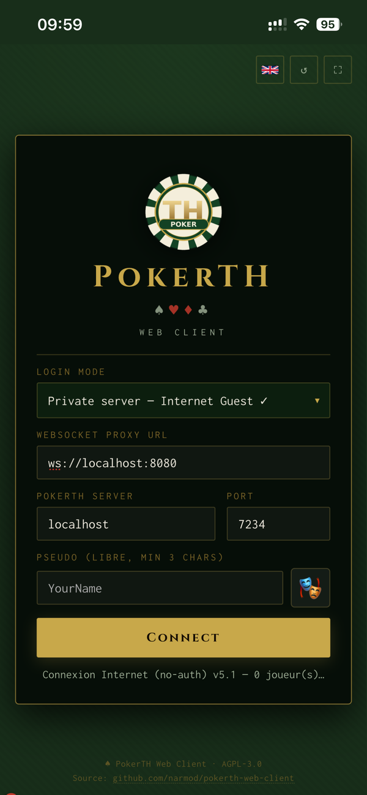
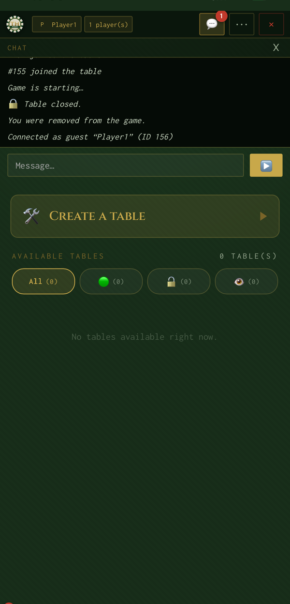
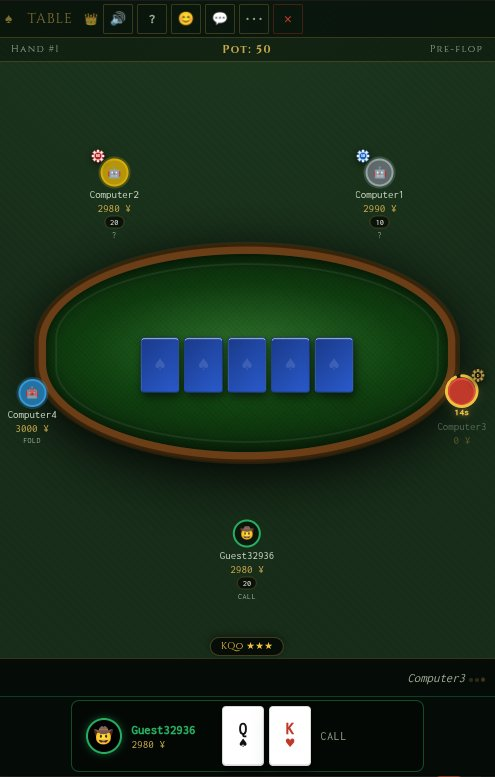
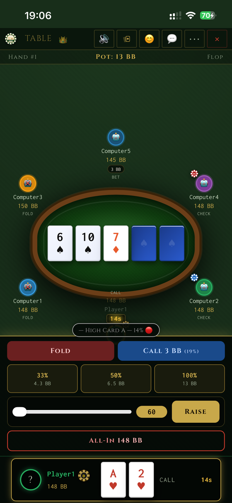

# PokerTH Web Client

> A modern, mobile-friendly browser client for [PokerTH](https://github.com/pokerth/pokerth) — the legendary open-source Texas Hold'em poker game.

---

## 🎮 Live demo

**Try it now: [https://pokerth.ddns.net/](https://pokerth.ddns.net/)**

Pick the **Private server — Internet Guest** login mode, choose any nickname, and play right away — no account, no install. The demo is hosted on a small VPS connected to a private PokerTH server, so feel free to create a table and invite friends.

> Tip: it works just as well on mobile — add it to your home screen for a fullscreen app feel.

---

## Why this project exists

I have been playing PokerTH for years and have a deep appreciation for the incredible work the PokerTH team has put into this game over so many years. **Thank you** to every contributor who built and maintained it. ❤️

One day I wanted to play a family LAN game with my wife and teach poker to my kids — on tablets and phones, without installing anything. The problem: **there is no official web client for PokerTH**. You need the native desktop app, which does not run on iOS or Android.

So I sat down and built one.

It started as a very simple interface — just enough to deal a hand around the table. But every family game brought new feedback ("I can't tell the suits apart on my phone", "whose turn is it?", "can we have avatars?"), and little by little those suggestions grew the bare-bones prototype into the much more complete client it is today.

This project is a **web frontend** that connects to any PokerTH server directly from the browser, with no app installation needed. It is designed to work great on phones and tablets so that family poker nights are just a URL away.

---

## Screenshots

<table>
  <tr>
    <td align="center"><strong>Connect screen</strong></td>
    <td align="center"><strong>Lobby</strong></td>
  </tr>
  <tr>
    <td></td>
    <td></td>
  </tr>
  <tr>
    <td align="center"><strong>Game table</strong></td>
    <td align="center"><strong>Action bar</strong></td>
  </tr>
  <tr>
    <td></td>
    <td></td>
  </tr>
</table>

---

## Features

### Connection
- **4 login modes**: LAN (free nickname), Private server – Guest, pokerth.net – Guest, pokerth.net – Registered account
- Optional authenticated login over TLS
- TLS support (required for pokerth.net, optional for LAN). The TLS box auto-checks itself when you pick the registered-account mode.
- Auto-fill of `host = pokerth.net` and `port = 7234` when a pokerth.net mode is selected — other modes keep the auto-detected hostname
- Remember nickname / credentials via `localStorage`
- Refresh button and fullscreen toggle on every screen

### Lobby
- Real-time table list with player counts and status badges
- **⚡ Join or Create** — one-tap auto-join or table creation
- Advanced table creation: blinds, timeout (default 15 s), max players (default 5), bots fill, optional password
- Spectator mode (👁 Watch)
- Lobby chat

### Poker table
- Seats positioned according to server order, **locked after the first deal** (no mid-game layout jumps)
- Casino-style chip tokens: SB 🔵, BB 🔴, Dealer ⚫ gold — with `chipPop` animation
- SVG arc timer around the active player's avatar + seconds badge below
- **Card deal animation**: cards fly from the centre to each seat at the start of every hand
- **Chip slide animation**: chips glide toward the pot on bet / call / raise
- **3D flip animation** for community cards (flop × 3, turn, river)
- Pre-flop hand-strength hint (Sklansky-Malmuth chart)
- **Post-flop win probability** — Monte Carlo simulation against random opponent ranges
- **Spades vs clubs visual distinction**: spades get a subtle blue tint so ♠ and ♣ never get confused on small screens
- Pot strip showing hand number, total pot, and current betting round

### Player experience
- **Emoji avatar** selector: 🎭 button → 500+ icons organised by category (animals, fantasy, fun characters…)
- Avatars visible by all players in real time (broadcast via proxy `AVATAR:pid:emoji`)
- Anti-flicker cache so avatars survive seat re-renders
- Bots always show 🤖
- **Session statistics** panel (click your avatar): hands played, wins, win rate, net gain/loss, best/worst hand, last 5 hands with card history
- **Win streak badge** on seats for players on a hot run

### Chat & reactions
- In-lobby chat and in-game chat (dropdown panels)
- 30 emoji reactions with 6-second counter, broadcast to all players

### Comfort features
- Browser notifications when it is your turn (background tab)
- Tab title flashes: ⚡ YOUR TURN — PokerTH
- Keyboard shortcuts: **F** = Fold, **C** / Space = Call, **R** = Raise, **A** = All-in
- Sound effects: distinct sounds for fold / check / call / raise / all-in / shuffle / drumroll / bad-beat / win fanfare, plus urgent-timer warning
- Full i18n in 9 languages — German, English, Spanish, French, Italian, Dutch, Polish, Portuguese and Russian — switchable on the fly
- Fullscreen mode on all screens
- Poker hand reference overlay (? button)
- Exponential-backoff auto-reconnect with live countdown

### PWA
- `manifest.json` + Service Worker (`sw.js`) with versioned **network-first** cache
- New-version notification: the page tells the user when an updated service worker is ready and applies the update on the next reload
- Installable on mobile and desktop ("Add to Home Screen")

---

## Login modes & transport

The client is designed first and foremost for **LAN and private self-hosted servers** — that is its intended use. Each mode uses a different transport, which is handy to know when debugging a connection problem.

| Mode | Target server | Transport | Notes |
|---|---|---|---|
| **LAN** (free nickname) | your local PokerTH server | proxy → TCP raw | TLS off by default |
| **Private server — Guest** (`unauth`) | your private remote PokerTH server | proxy → TCP or TLS (your choice) | The default for self-hosted setups |

The client can also connect to the public **pokerth.net** server (guest or registered account) over a direct TLS WebSocket, bypassing the proxy. Please use that responsibly and prefer your own LAN or private server for regular play, out of respect for the official PokerTH infrastructure.

---

## Architecture

Browsers cannot open raw TCP/TLS connections to classic PokerTH servers. This project bridges the gap with a tiny Node.js proxy:

```text
Browser WebSocket  ⇄  proxy.js (Node.js)  ⇄  PokerTH TCP/TLS server
```

When connecting to the public pokerth.net server, the browser connects directly over a TLS WebSocket and the proxy is bypassed.

The proxy also serves the static files and relays two custom broadcast messages to all connected clients:

| Message | Purpose |
|---|---|
| `REACT:pid:emoji` | Emoji reaction from a player |
| `AVATAR:pid:emoji` | Avatar emoji update |

### Repository layout

```text
pokerth-web-client/
├── proxy.js                 # WS→TCP/TLS proxy + static HTTP server
├── public/
│   ├── pokerth-client.html  # HTML shell + inline head scripts
│   ├── pokerth.js           # Full application logic
│   ├── pokerth.css          # Styles
│   ├── manifest.json        # PWA manifest
│   ├── sw.js                # Service Worker (versioned cache)
│   ├── modules/             # ES modules: i18n, sounds, and lang/ (9 locales)
│   ├── proto/               # Protobuf bundle & helpers
│   └── favicon-*.png        # PWA icons
├── docs/
│   ├── PROJECT.md
│   ├── ROADMAP.md
│   ├── SECURITY.md
│   └── screenshots/         # Screenshots used in this README
├── scripts/
│   └── build-proto.mjs      # Regenerates the protobuf bundle from .proto
├── install.sh               # One-line installer (Node.js + PM2 + service)
├── Dockerfile               # Multi-arch image (node:20-alpine base)
├── docker-compose.yml       # One-shot self-host config
├── package.json
├── LICENSE                  # AGPL-3.0-or-later
└── README.md
```

---

## Requirements

- **Node.js 18** or newer (Node 20 LTS recommended)
- **npm** (shipped with Node.js)
- **git**
- A modern browser (Chrome, Firefox, Safari, Edge)
- A running PokerTH server (local LAN, your own remote server, or pokerth.net)

---

## Quick install (one-liner)

On a fresh **Debian/Ubuntu** machine you can install everything — Node.js, PM2, the project, and a boot-persistent service — with a single command:

```bash
curl -sSL https://raw.githubusercontent.com/narmod/pokerth-web-client/HEAD/install.sh | bash
```

The installer asks a couple of questions (port, LAN/TLS mode, install directory), then runs the proxy under PM2 as a **non-root** user with start-on-boot. It is safe to re-run: an existing install is updated rather than duplicated.

> **Prefer to read before you run?** A healthy instinct for any `curl | bash` installer. Download and inspect it first:
>
> ```bash
> curl -sSL https://raw.githubusercontent.com/narmod/pokerth-web-client/HEAD/install.sh -o install.sh
> less install.sh        # review what it does
> bash install.sh        # then run it
> ```

When run without a terminal (CI / automation) the installer is fully non-interactive and takes its settings from environment variables:

| Variable | Default | Purpose |
|---|---|---|
| `PORT` | `8080` | HTTP / WebSocket port |
| `NO_TLS` | _(unset)_ | set to `1` for LAN mode (`--notls`) |
| `INSTALL_DIR` | `<run-user home>/pokerth-web-client` | install location |
| `RUN_USER` | invoking user, or `pokerth` when run as root | non-root user that runs PM2 |
| `APP_NAME` | `pokerth-web` | PM2 process name |
| `SETUP_FIREWALL` | _(unset)_ | set to `1` to open the port in `ufw` |
| `ASSUME_YES` | _(unset)_ | set to `1` to skip the confirmation prompt |

Example:

```bash
PORT=8090 NO_TLS=1 ASSUME_YES=1 \
  bash -c "$(curl -sSL https://raw.githubusercontent.com/narmod/pokerth-web-client/HEAD/install.sh)"
```

For HTTPS (recommended — many mobile browsers block plain `ws://`), follow the Nginx + Let's Encrypt steps in the manual installation below.

---

## Manual installation (Ubuntu / Debian)

Prefer to do it by hand, or need a custom setup? These are the full steps the one-liner automates. This walkthrough assumes a clean Ubuntu 22.04 / 24.04 or Debian 12 VPS. Adapt commands for other distributions.

### 1. Update the system

```bash
sudo apt update && sudo apt upgrade -y
```

### 2. Install build tools, git and curl

```bash
sudo apt install -y curl git build-essential
```

### 3. Install Node.js 20 LTS (via NodeSource)

The Node.js shipped in Ubuntu's default repos is often too old. Use the official NodeSource repo to get a recent LTS:

```bash
curl -fsSL https://deb.nodesource.com/setup_20.x | sudo -E bash -
sudo apt install -y nodejs
```

Verify:

```bash
node -v   # should print v20.x.x or newer
npm -v    # should print 10.x or newer
```

### 4. Install PM2 globally (process manager)

PM2 keeps the proxy alive in the background and restarts it automatically at boot or after a crash.

```bash
sudo npm install -g pm2
```

### 5. Clone the project and install dependencies

```bash
git clone https://github.com/narmod/pokerth-web-client.git
cd pokerth-web-client
npm install
```

You may see two `npm WARN deprecated` lines about `inflight` and `glob` — these are pulled in by `protobufjs-cli` (a dev-only dependency used to rebuild the protobuf bundle). They are harmless at runtime. `npm audit` should report **0 vulnerabilities**.

### 6. Open the firewall

If `ufw` is active on the server:

```bash
sudo ufw allow 8080/tcp     # if you serve directly on 8080
# OR (recommended) 80/443 if you put Nginx in front
sudo ufw allow 80/tcp
sudo ufw allow 443/tcp
```

Cloud providers (IONOS, OVH, Hetzner, etc.) often have their **own firewall in front of the VPS** that is independent of `ufw`. Make sure to open the same ports in their control panel too, otherwise the port stays unreachable from outside.

### 7. Start the proxy with PM2

```bash
pm2 start proxy.js --name pokerth-web
pm2 save
pm2 startup       # then run the command it prints, to enable boot-time start
```

Verify:

```bash
pm2 status
pm2 logs pokerth-web --lines 30
```

The client is now live at `http://<your-server-ip>:8080`.

### 8. (Recommended) Add HTTPS with Nginx + Let's Encrypt

A direct WebSocket on port 8080 works, but many mobile browsers and corporate networks **block plain `ws://` connections**. Adding HTTPS via Nginx solves this for free and gives you a clean URL.

You need a domain name pointing to the server's IP. Free options include [No-IP](https://www.noip.com/) (`yourname.ddns.net`) or [DuckDNS](https://www.duckdns.org/) (`yourname.duckdns.org`).

Install Nginx and Certbot:

```bash
sudo apt install -y nginx certbot python3-certbot-nginx
```

Create `/etc/nginx/sites-available/pokerth` (replace `your-domain.example` with your real hostname):

```nginx
server {
    listen 80;
    server_name your-domain.example;

    location / {
        proxy_pass http://localhost:8080;
        proxy_http_version 1.1;
        proxy_set_header Upgrade $http_upgrade;
        proxy_set_header Connection "upgrade";
        proxy_set_header Host $host;
        proxy_set_header X-Real-IP $remote_addr;
        proxy_set_header X-Forwarded-For $proxy_add_x_forwarded_for;
        proxy_set_header X-Forwarded-Proto $scheme;
        proxy_read_timeout 86400;
        proxy_send_timeout 86400;
    }
}
```

Enable and reload:

```bash
sudo ln -s /etc/nginx/sites-available/pokerth /etc/nginx/sites-enabled/
sudo rm -f /etc/nginx/sites-enabled/default
sudo nginx -t
sudo systemctl reload nginx
```

Obtain the certificate (Certbot will edit the config to add HTTPS automatically):

```bash
sudo certbot --nginx -d your-domain.example
```

Pick option `2 — Redirect HTTP to HTTPS` when asked. Renewal is automatic via a systemd timer.

The client is now live at `https://your-domain.example`. In the connect form, the WebSocket Proxy URL field will auto-fill with `wss://your-domain.example` (the JS detects the protocol).

### 9. Updating the proxy later

```bash
cd ~/pokerth-web-client
git pull
npm install              # only if package.json changed
pm2 restart pokerth-web
```

---

## Running locally (development)

If you only want to play around on your own machine:

```bash
git clone https://github.com/narmod/pokerth-web-client.git
cd pokerth-web-client
npm install
```

### Standard (TLS enabled, recommended)

```bash
npm start
```

Then open **http://localhost:8080** in your browser.

### LAN (no TLS)

```bash
npm run start:lan
```

### Custom port

```bash
node proxy.js 8090
```

### Development (ignore untrusted TLS certificate)

```bash
npm run start:insecure
```

> ⚠️ `--insecure` disables TLS certificate verification. Use only for local development.

### Docker

The repository ships with a `Dockerfile` and a `docker-compose.yml` for one-command self-hosting:

```bash
docker compose up -d
```

The proxy will be available on `http://<host>:8080/`.

---

## Quick start — LAN family game

1. Run the proxy on any computer on your local network.
2. Find that computer's local IP (e.g. `192.168.1.10`).
3. Open `http://192.168.1.10:8080` on any phone or tablet on the same Wi-Fi.
4. Choose **LAN** login mode, pick a nickname, and join or create a table.
5. Deal cards and enjoy!

---

## Protocol notes

PokerTH speaks a length-prefixed Protobuf-based protocol over TCP. This client parses and emits a hand-written subset of those messages — there is no full Protobuf runtime in the browser, which keeps the bundle small.

A few things worth knowing if you plan to hack on this:

- The proxy logs every parsed message in hex with a short description, which makes protocol debugging straightforward (`pm2 logs pokerth-web` if you run under PM2).
- Wire-type field numbers used by this client are documented inline in `public/pokerth.js` next to each `Proto.encode([...])` call, with references to `pokerth.proto` in the upstream repository.

---

## Known limitations

- The Protobuf protocol is still handled by a small hand-written encoder/decoder rather than generated classes.
- The bulk of the logic still lives in a single `pokerth.js` file, though i18n, sounds and the protocol layer have already been extracted into ES modules. Further splitting would help.
- More automated protocol tests are needed before calling the client production-ready.
- Spectator mode works but lacks a few quality-of-life touches (e.g. you cannot see other players' cards at showdown the same way the native client does).

---

## Roadmap / Suggested next steps

1. Replace the hand-written Protobuf encoder/decoder with generated classes from `pokerth.proto`.
2. Split the client into maintainable ES modules *(in progress — i18n, sounds and the protocol layer are already extracted)*.
3. Add automated protocol tests with a mock PokerTH server.
4. Polish reconnection edge cases (currently exponential backoff with a 5-attempt cap).
5. More avatar options and a custom-emoji import.
6. Optional spectator-only view (read-only embed for streamers).

---

## License

This project is licensed under the **GNU Affero General Public License v3.0 or later** — the same license as PokerTH itself.

---

## Acknowledgements

A huge thank you to the entire **PokerTH team** for creating and maintaining such a wonderful open-source poker game over all these years. This project would not exist without your work. 🙏
