# PokerTH Web Client

<p align="center">
  <a href="https://pokerth.ddns.net/">
    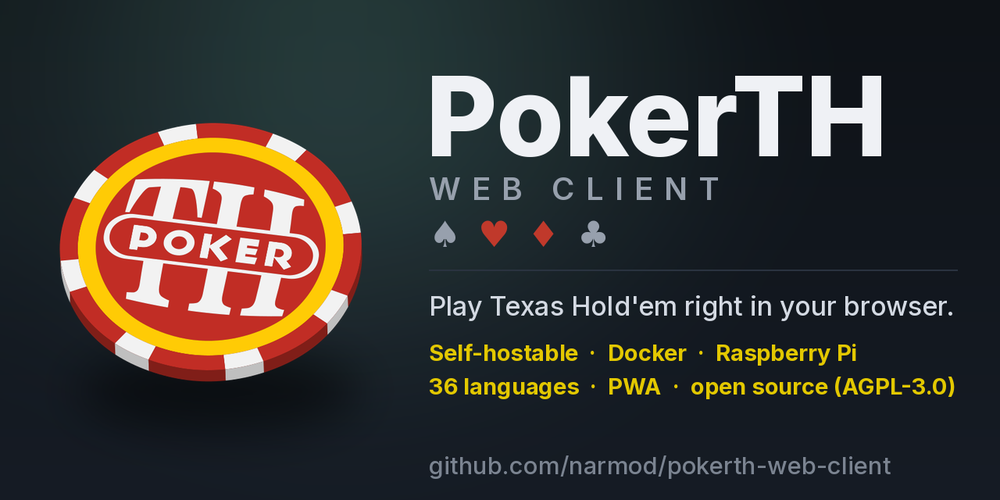
  </a>
</p>

<p align="center">
  <strong>Play <a href="https://github.com/pokerth/pokerth">PokerTH</a> — the legendary open-source Texas Hold'em — right in your browser.</strong>
  <br/>
  No install &middot; phone, tablet &amp; desktop &middot; installable as a PWA &middot; play offline against bots &middot; connect to any PokerTH server.
</p>

<p align="center">
  <a href="https://pokerth.ddns.net/"></a>
</p>

<p align="center">
  <a href="https://github.com/narmod/pokerth-web-client/actions/workflows/docker-publish.yml"></a>
  <a href="https://github.com/narmod/pokerth-web-client/pkgs/container/pokerth-web-client"></a>
  <a href="#raspberry-pi"></a>
  <a href="LICENSE"></a>
</p>

---

<a id="highlights"></a>
## ✨ Highlights

- 🎮 **Zero install** — open a URL and you're at the table
- 📱 **Installable PWA** — add to your home screen for a fullscreen app feel on iOS &amp; Android
- 🏋️ **Offline training vs bots** — no server, proxy or connection required
- 🔌 **Any PokerTH server** — including the public **pokerth.net**
- 🃏 **Full Texas Hold'em** — flying card deals, sliding chips, 3D card flips, emoji reactions, in-game chat and a hand log
- 🎨 **Deep theming** — a QML-style styles window: table felt × card deck × card back × seats (buttons & pucks follow the table style)
- ☁️ **Settings that follow you** — sign in with a registered account on your dedicated server and **every** option syncs automatically across your devices: the official settings travel as a standard PokerTH `config.xml`, and the web-only extras (theme, seats, keyboard, voice…) as a separate blob — on by default, one tap to turn off
- 🌍 **36 languages**
- 🤝 **Tracks the official QML client** — F-key shortcuts, admin tools, sounds, full chat and more, kept in sync as the official client evolves (currently the 2.1.4 build)

<p align="center">
  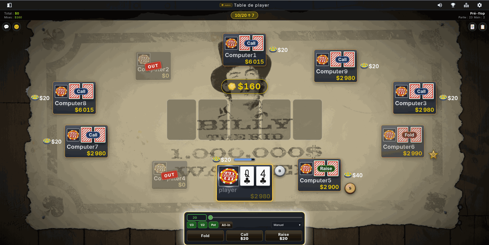
  <br/>
  <em>The web client in action — a ten-seat table on a custom felt, with the game status bar, dealer and blind pucks, per-seat action badges and the action bar with quick-bets and auto-modes</em>
</p>

<!-- 🎞️ HERO GIF SLOT — once docs/screenshots/00-hero.gif is recorded, add it just above the screenshot above:
     <p align="center"></p>
-->

---

## Contents

<sub>📂 = collapsible section — click the **“Show…”** line to expand it.</sub>

- [✨ Highlights](#highlights)
- [🎮 Live demo](#live-demo)
- [Why this project exists](#why-this-project-exists)
- [Screenshots](#screenshots)
- [Features](#features)
- [Login modes &amp; transport](#login-modes-transport)
- [Playing a game](#playing-a-game)
- [Architecture](#architecture)
- [Requirements](#requirements)
- [Self-hosting](#self-hosting)
  - [Quick install (one-liner)](#quick-install-one-liner) &nbsp;📂
  - [Docker](#docker) &nbsp;📂
  - [Environment variables](#env-vars) &nbsp;📂
  - [Manual installation (Ubuntu / Debian)](#manual-installation) &nbsp;📂
  - [Self-hosting on a Raspberry Pi](#raspberry-pi)
- [Install the app](#install-the-app)
- [Managing &amp; resetting](#managing-resetting)
  - [Managing the service](#managing-the-service)
  - [The admin panel](#admin-panel)
  - [Optional MySQL mirror](#mysql-mirror)
  - [Resetting the family leaderboard](#leaderboard-reset)
- [Development (running from source)](#development) &nbsp;📂
- [Protocol notes](#protocol-notes)
- [🩺 Diagnosing a problem](#diagnosing)
- [Known limitations](#known-limitations)
- [Roadmap / Suggested next steps](#roadmap)
- [License](#license)
- [Acknowledgements](#acknowledgements)

---

<a id="live-demo"></a>
## 🎮 Live demo

**Try it now: [https://pokerth.ddns.net/](https://pokerth.ddns.net/)**

Play right away — no account needed, no install. Pick **🌐 Internet** to join the public, official pokerth.net server (as a guest, or with your registered account), or **LAN / Dedicated server** to play on the demo's own PokerTH server, hosted on a small VPS — choose any nickname (Guest mode off), create a table, and invite friends.

Want to try with **no server or connection at all**? Pick **🏋️ Training mode** and play instantly against bots — fully offline.

> Tip: it works just as well on mobile — add it to your home screen for a fullscreen app feel.

---

## Why this project exists

I've been playing PokerTH for years, and I have deep respect for the work the PokerTH team has poured into this game over so long. **Thank you** to every contributor who built and maintained it. ❤️

One day I wanted to run a family LAN game — play with my wife, teach my kids poker — on the tablets and phones already lying around the house. There was an Android build, but **nothing for iOS**, and even on Android it meant asking everyone to download and set up an app before a single card was dealt. What I wanted was something dead simple: send a link, tap it, sit down at the table.

So I sat down and built one.

It started as a very simple interface, just enough to deal a hand around the table. But every family game brought new feedback — *"I can't tell the suits apart on my phone"*, *"whose turn is it?"*, *"can we have avatars?"* — and little by little those suggestions turned a bare-bones prototype into something far more complete. I put it on GitHub, figuring that if I wanted a web client, someone else probably did too.

Then something wonderful happened: I showed the project to the PokerTH team. They liked the idea, and **I'm now part of the PokerTH development team**, working on this client so it can become an **official PokerTH client**. The project changed shape — the layout is now based on the team's next-generation **QML client**, and the goal is a faithful web clone of that app: same seat placement, same action bar, same colors, same behaviour, kept in sync as the official client evolves.

This project is a **web frontend** that connects to any PokerTH server straight from the browser, with no app to install. It's built to work well on phones and tablets, so a family **PokerTH** night is only ever a URL away.

---

## Screenshots

<p align="center">
  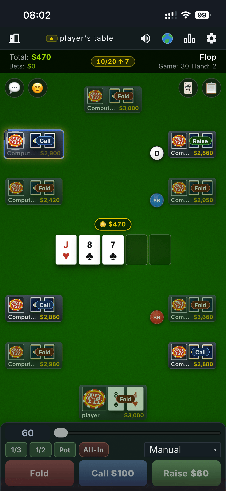
  <br/>
  <em>A full 10-seat table on a phone — official QML seat layout, dealer &amp; blind pucks, game status bar, pot badge and the official action bar</em>
</p>

<div align="center">

<table>
  <tr>
    <td align="center"><strong>Create a table — game style</strong></td>
    <td align="center"><strong>Create a table — blinds &amp; bots</strong></td>
  </tr>
  <tr>
    <td align="center">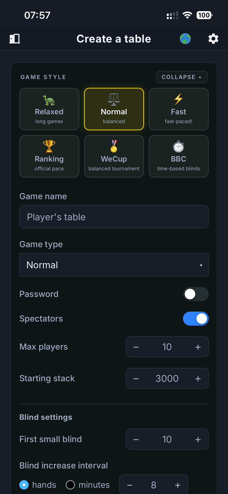</td>
    <td align="center">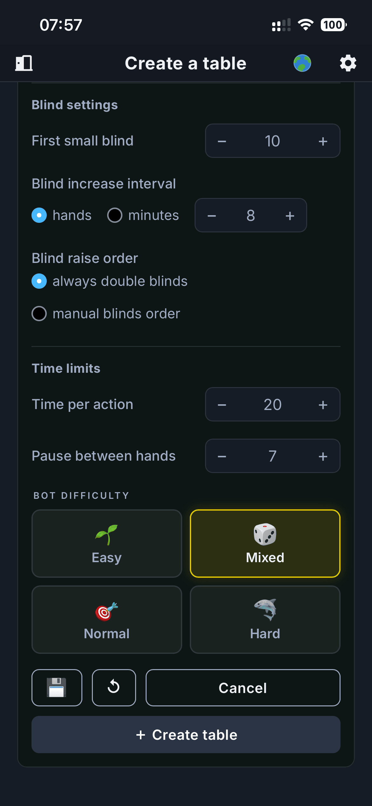</td>
  </tr>
  <tr>
    <td align="center"><strong>Connect — dark</strong></td>
    <td align="center"><strong>Connect — light</strong></td>
  </tr>
  <tr>
    <td align="center">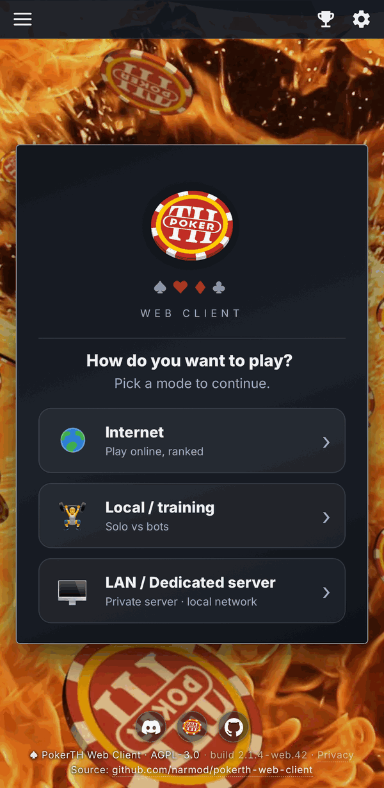</td>
    <td align="center">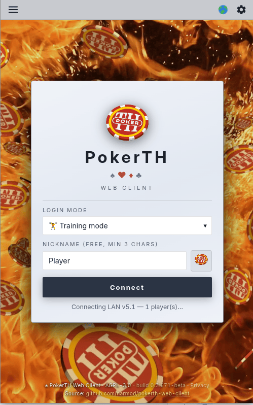</td>
  </tr>
  <tr>
    <td align="center"><strong>Lobby &amp; chat</strong></td>
    <td align="center"><strong>Waiting room</strong></td>
  </tr>
  <tr>
    <td align="center">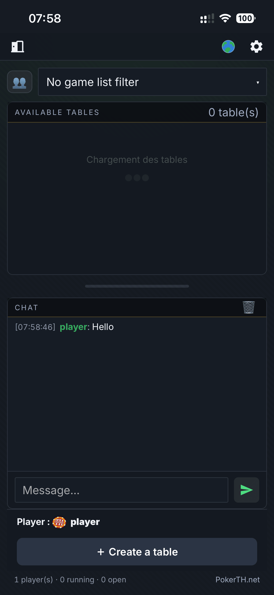</td>
    <td align="center">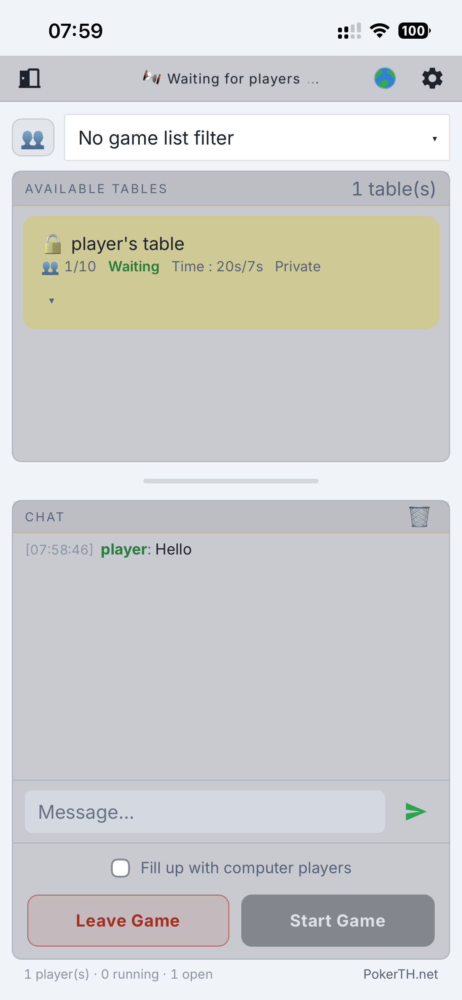</td>
  </tr>
  <tr>
    <td align="center"><strong>Winner window</strong></td>
    <td align="center"><strong>Emoji reactions</strong></td>
  </tr>
  <tr>
    <td align="center">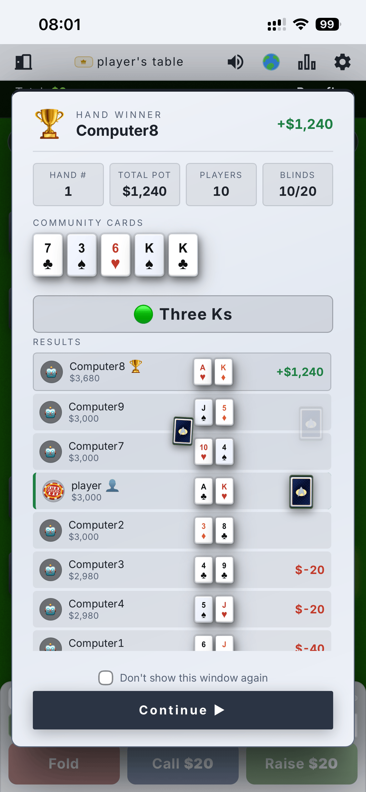</td>
    <td align="center">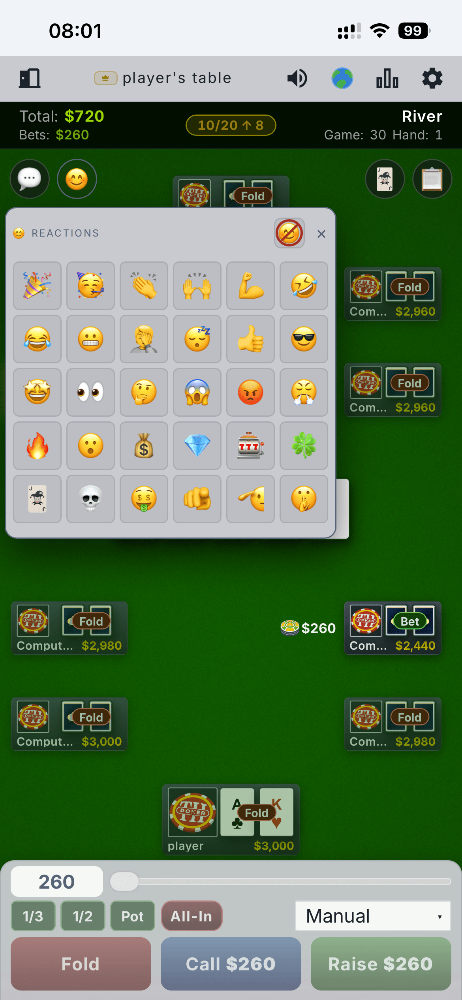</td>
  </tr>
  <tr>
    <td align="center"><strong>Ranking — PokerTH · BBC · WEC</strong></td>
    <td align="center"><strong>In-game chat</strong></td>
  </tr>
  <tr>
    <td align="center">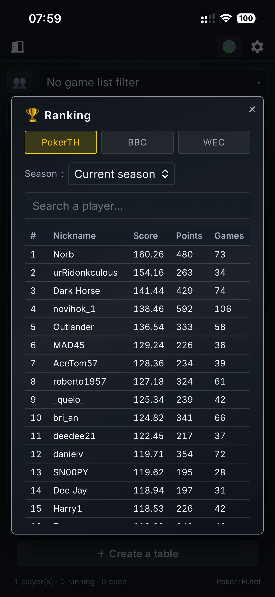</td>
    <td align="center">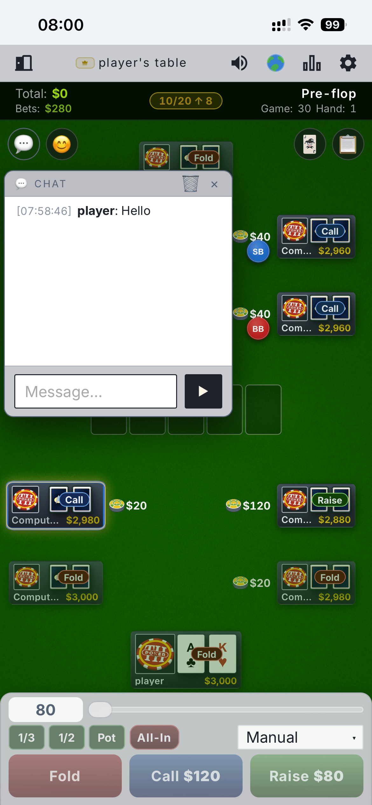</td>
  </tr>
  <tr>
    <td align="center"><strong>Avatar gallery — light</strong></td>
    <td align="center"><strong>Avatar gallery — dark</strong></td>
  </tr>
  <tr>
    <td align="center">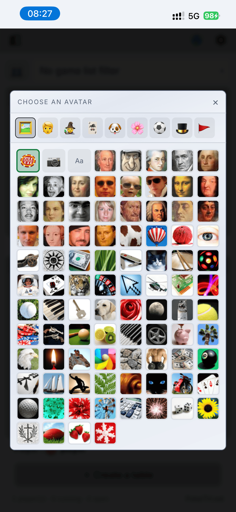</td>
    <td align="center">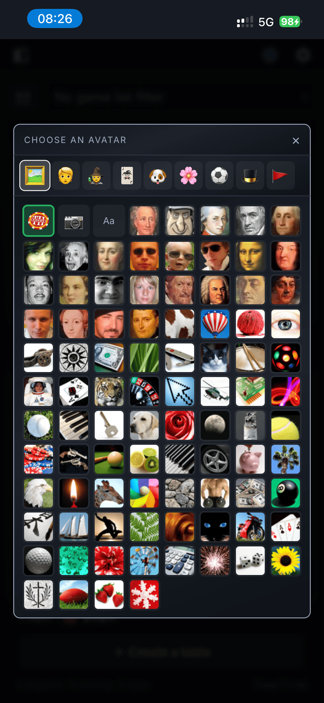</td>
  </tr>
</table>

</div>

<p align="center">
  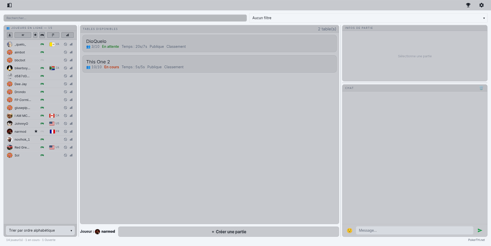
  <br/>
  <em>The lobby on a wide screen — players online with country flags and stats on the left, tables in the middle, game info and chat on the right</em>
</p>

<p align="center">
  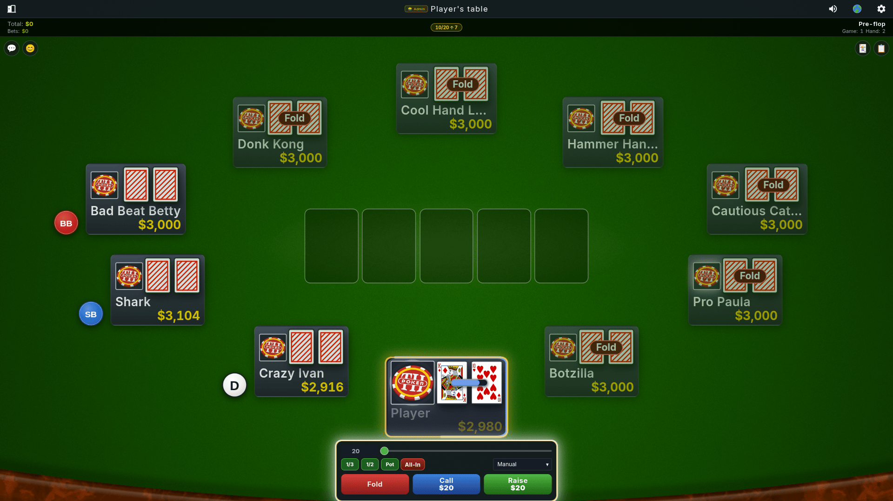
  <br/>
  <em>A full 10-seat table in the dark theme — training mode against nine bots, glossy action buttons and quick-bets</em>
</p>

<div align="center">
<table>
  <tr>
    <td align="center">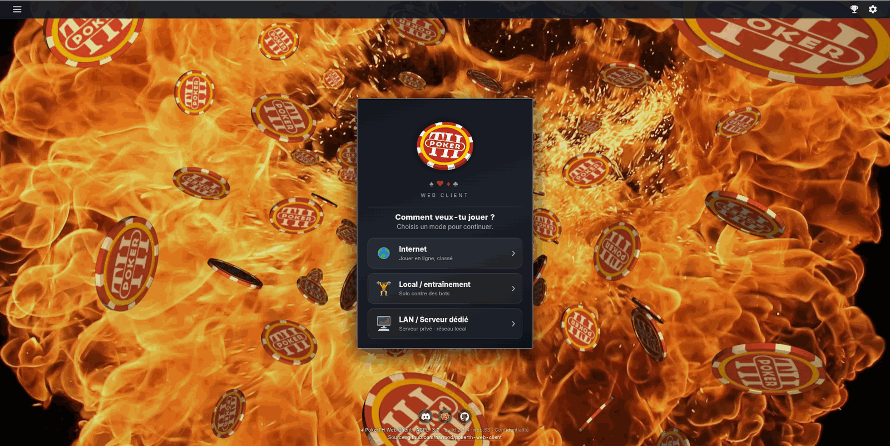</td>
    <td align="center">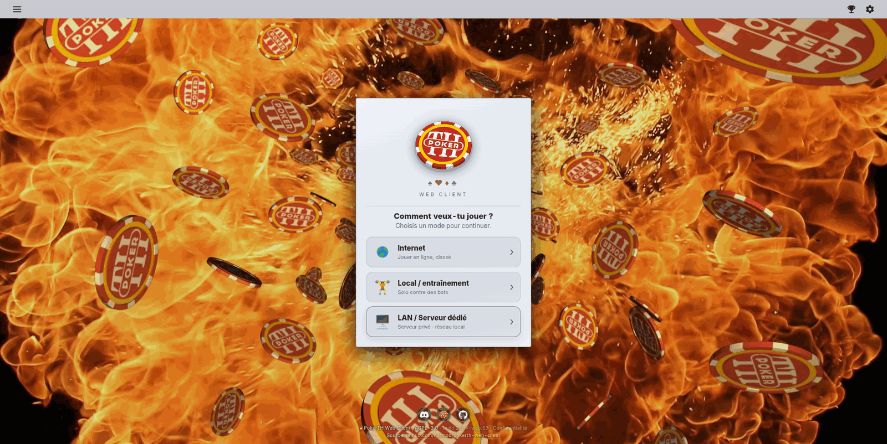</td>
  </tr>
</table>
</div>

<p align="center">
  <em>The connect screen on desktop, dark and light — pick a mode, type a nickname and you're in</em>
</p>

---

## Features

### Connection
- **3 server choices + a Guest-mode toggle**: pick **🖥️ LAN / Dedicated server**, **🌐 Internet** (the public pokerth.net server), or **🏋️ Training mode** (offline solo play against bots), then use the **Guest mode** checkbox (just above the Connect button, off by default) to switch the guest/registered variant of the two online choices. Internally the online choices still map to the four PokerTH login types; **Training mode runs entirely in the browser with no server, proxy, or connection**.
- Optional authenticated login over TLS
- TLS support (required for pokerth.net, optional for LAN). The TLS box auto-checks itself when you turn **Guest mode** off on the Internet choice (registered-account login).
- Auto-fill of `host = pokerth.net` and `port = 7234` when **🌐 Internet** is selected — the dedicated-server choice keeps the auto-detected hostname
- Remember nickname / credentials via `localStorage`
- Refresh button and fullscreen toggle on every screen

### Lobby
- Real-time table list with player counts, status badges, and each table's blind level and raise schedule
- Table filters: **All / 🟢 Open / 🔓 No password / 👁 Live / Ranked** (remembered across sessions)
- **⚡ Join or Create** — one-tap auto-join or table creation
- Advanced table creation: blinds, action timeout, max players, **bot difficulty** (Easy / Mixed / Normal / Hard), **game-style presets** (🐢 Relaxed / ⚖️ Normal / ⚡ Fast, tournament presets **Ranking / WeCup / BBC**, plus a **My prefs** slot that saves your own mix), **blind-increase schedule** (every N hands or N minutes) with a raise mode (double / to a target / keep last), table speed (1–10), deal delay, **game type** (Normal / Registered-only / Invite-only), ranking on/off, spectators allowed/blocked, bots fill (with a min-humans-before-bots threshold), and an optional password
- Spectator mode (👁 Watch)
- Players list with **A–Z / by-country sorting** and live search
- Lobby chat
- **Waiting room** — while a table fills up, your details and chat sit centre-stage with the game list beside them on desktop, an animated "waiting for players" status, and a tap-to-expand accordion listing each table's seated players
- **🏆 Ranking** — a leaderboard modal (🏆 button on the connect screen and in the lobby) covering **PokerTH, BBC and WEC** rankings, with a season picker, an All-Time toggle, and — on the PokerTH source — live search and pagination; results are cached briefly client-side. Tapping a player opens their **profile card** (member since, last login, current-season rank/score, last 5 games) fetched live from the same relay
- **🏆 Trophées (Training mode)** — a fourth tab in the ranking window, shown only in Training mode once connected, with 27 achievements grouped by Progress · Skill · Play-style · Fun · PokerTH formats. Locked ones are greyed out, a 👥 badge marks achievements that need a set number of players, and unlocking one pops a toast; an "X/27" counter also appears on your profile card and the end-of-game screen. Localised in all 36 languages
- **Invite a player** to your table from the lobby players list — reaches the invited player instantly, including on the official desktop/mobile clients
- **Vote-kick** — any player can start a community petition to remove a disruptive player mid-game; others vote to resolve it (separate from the admin-only Kickban, see *Official client (QML) tracking* below)
- **Country flag on avatar** — an optional badge showing each player's country, sourced from the server

### Poker table
- Seats positioned according to server order, **locked after the first deal** (no mid-game layout jumps)
- **Responsive seat layout** — on phones and tablets the seats tighten around the felt so players stay close to the table; desktop keeps the wider layout. Portrait offers four seat renderings — automatic ring, official fixed slots, elliptical "necklace", and a free drag-and-drop custom layout — with seat geometry tuned to the official 2.1.3 client (self-weight 0.3 wide / 0.5 compact, fill-cap 1.9 / 2.3)
- **Table zoom** — the base layout is always the faithful QML bisection (zoom 1); zoom is a uniform magnifier layered on top. On desktop, **+ / −** buttons enlarge or shrink the felt, community cards and opponents together (your own bar and the action bar stay put, the level is remembered, and the maximum is capped so the whole table stays on screen). On touch phones a **loupe button** toggles the official ×2 magnifier (QML `zoomLayer` parity): pan with a finger, auto-follow of the active seat, and automatic zoom-out at showdown
- Casino-style chip tokens: SB 🔵, BB 🔴, Dealer ⚫ gold — with `chipPop` animation
- SVG arc timer around the active player's avatar + seconds badge below
- **Card deal animation**: cards fly from the centre to each seat at the start of every hand
- **Chip slide animation**: chips glide toward the pot on bet / call / raise
- **3D flip animation** for community cards (flop × 3, turn, river)
- Pre-flop hand-strength hint (Sklansky-Malmuth chart)
- **Post-flop win probability** — Monte Carlo simulation against random opponent ranges
- **Spades vs clubs visual distinction**: spades get a subtle blue tint so ♠ and ♣ never get confused on small screens
- Pot strip showing hand number, total pot, and current betting round
- **In-game header** — the table name is centred with Admin / Public-Private status badges in the official palette. Tap it for the full **table info popup**: game type (public/private), configuration (blinds, starting stack, action timer), live state (phase, hand number, pot) and the player list

### In-game settings (⚙ menu)
Per-player toggles, remembered in `localStorage` and applied instantly:
- **BB / ¥ display** — show amounts as big blinds or as chips
- **Assistance** — show or hide the pre-flop hand-strength + post-flop win-probability help above the action bar
- **Voice announcements** — spoken turn and action callouts (Web Speech API)
- **Vibration** — haptic feedback on your turn (where supported)
- **Sound on/off** (🔊) — mute or unmute all sound effects

Plus a full **Advanced options** panel (sectioned: cards, betting, table, seats, chat, avatars, sounds, keyboard) with, among others: **chat translation** (a per-message 🌐 button using the browser's translation API), the **winner window** at end of hand, **remove departed players & re-seat the table**, **pause between hands** (continue from the winner window), **keep the action bar open** (pin), an **enlarge-my-cards** control (several zoom levels), the **hand-odds panel** toggles, **game logging** (on/off + interval), the **Game Settings dialog** on new game, and the account-sync switch below.

**Account sync** ☁️ — with a **registered login**, all your settings automatically sync to your account and follow you across devices. Two blobs travel together: every option with an official PokerTH key syncs as the exact same `config.xml` as the manual export/import (fully interoperable with the official clients), while the web-only settings — web theme, action-button / puck / seat styles, custom seat placement, keyboard shortcuts, language, voice & vibration, assistance, BB display, offline bot level, ignore list and more — sync as a separate JSON blob that never touches the official file. Both are stored on the proxy server only after the PokerTH server has verified your SCRAM login — guests never sync. **Scope:** sync works for registered accounts on servers reached *through the proxy* (your dedicated / self-hosted server). With the default **Direct WS** transport, the **🌐 Internet** choice connects straight to `wss://www.pokerth.net` and bypasses the proxy entirely, so pokerth.net accounts don't sync — by design, your pokerth.net password and traffic never touch the proxy. (If the operator switches the Internet transport to **Via proxy**, pokerth.net logins then flow through the proxy like any dedicated server, and registered accounts sync there too.) Simultaneous logins are not a concern either: the PokerTH server itself refuses a second connection with a name already in use. Writes are debounced, deduplicated, rate-limited and atomic. Enabled by default; opt out anytime in the options.

### Themes & customization
A full appearance system, reached from the **Theme** button — a styles window modelled on the official client's *Style* settings, with four tabs (each choice remembered in `localStorage`):
- **Table** — 13 table styles listed with a large preview, name and author, exactly like the official QML style picker: PokerTH (default), Spectator Tools, Green Casino, Danuxi Blue, Mute, Mute 02, Teal, Lemming, Matrix, Star Trek, TripSixes, Wanted, Xanax. Like the official `StyleProvider`, each table style carries its own felt, pucks and action-button skins — buttons and pucks are no longer separate axes
- **Cards** — four built-in decks (PokerTH, PokerTH 1.0, **PokerTH Royal Classic** — the default, the official QML client's own deck — and Green Casino) plus the official PokerTH decks in the gallery
- **Card back** — its own axis, independent from the deck, with an *Import an image…* option
- **UI palette** (Dark / Light / Auto) follows the official *Dark Mode* setting in the Advanced options, matching the QML client
- **Seat styles** — eight theme-aware seat "packs", switchable like decks: **PokerTH landscape** and **PokerTH portrait** (faithful renders of the official QML player boxes), **Classic** (the historical render), **Chip**, **Plate**, **Card**, **Compact**, and **Bar**. Pack names stay in English across all languages (like the poker terms). The default is the PokerTH pack matching the screen orientation, and an **orientation-sync option** (on by default) swaps portrait ↔ landscape automatically as you rotate; any explicit choice is saved in `localStorage` and always wins
- **Light & dark aware**: every theme carries its own `color-scheme`, and the browser status-bar `theme-color` follows the active theme
- **Glossy coloured action buttons** (Fold red / Check-Call blue / Raise green / All-In orange) and a live preview of each card deck right in the panel
- Fully **localized in all 36 languages** and switchable instantly, with no reload
- **Official accent** — gold uses PokerTH's QML accent `#E3C800`, kept only for deliberate game assets (dealer button, chip denominations, win bursts)
- **Import a style** — add a table or card deck from a local `.zip` (parses the official 2.1.3 style keys), or a custom card-back image
- Operators can set a **default theme** for first-time visitors (see [the admin panel](#admin-panel))

### Player experience
- **Emoji avatar** selector: 🎭 button → 500+ icons organised by category (animals, fantasy, fun characters…)
- Avatars visible by all players in real time (broadcast via proxy `AVATAR:pid:emoji`)
- **Custom image avatar** — use your own photo instead of an emoji, shared live with the table (broadcast via `AVATARIMG:pid:dataURL`)
- **Avatars also reach the official clients** — your chosen avatar (emoji, image, or initial) is uploaded over PokerTH's native avatar protocol, so it appears for players on the official desktop/mobile clients too, not just other web players
- Anti-flicker cache so avatars survive seat re-renders
- Bots always show 🤖
- **Session statistics** panel (click your avatar): hands played, wins, win rate, net gain/loss, best/worst hand, last 5 hands with card history
- **Family leaderboard** (LAN / private server): a shared per-nickname ranking persisted on the server, **sortable** (net winnings, ¥ per 100 hands, hands played…), with a configurable automatic reset (off / daily / monthly / yearly) plus on-demand reset
- **Win streak badge** on seats for players on a hot run

### Chat & reactions
- In-lobby chat and in-game chat (dropdown panels)
- **Emoji picker in chat** (desktop) — a 😊 button in the chat input (both lobby and in-game) opens an emoji grid; click to insert it at the cursor, then send like any text. Hidden on mobile, where the native keyboard already provides emojis
- 30 emoji reactions with a 6-second counter, broadcast to all players
- **Cross-client reactions**: reactions also travel through a shared `/emoji` chat command (handled like `/me`), so they reach other clients and work on pokerth.net too — while a fast `REACT:` relay stays the web↔web path
- **Ignore a player** — a 🔕 button in any player's card mutes them: their chat messages stop appearing, persisted across sessions by nickname; an advanced toggle chooses whether their avatar stays visible or is hidden too
- **Mute reactions** — a toggle in the reactions panel silences incoming reactions locally (no animation, badge or sound) without affecting anyone else; remembered across sessions
- **Disable emojis in chat** — an advanced option that strips emojis from received chat messages (mirrors the official client's setting)
- **Chat message translation** — a 🌐 button on every received chat message translates it into your interface language via **Google Translate** (tap again to switch back to the original). Enabled by default, can be turned off in Advanced options. The message text is sent to Google's translation service only when you tap the button — see the privacy page.

### Comfort features
- Browser notifications when it is your turn (background tab)
- Tab title flashes: ⚡ YOUR TURN — PokerTH
- Keyboard shortcuts: **F** = Fold, **C** / Space = Call, **R** = Raise, **A** = All-in, plus **1 / 2 / 3** to arm a ⅓ / ½ / pot bet (then **R** to confirm) — the bet buttons show these keycaps on desktop. Every letter is **re-bindable** (Advanced options → Keyboard: tap a key, press the new one, Reset to restore), and the **official PokerTH keys work too**: F1–F4 actions (with the reverse-order option), F5 = Show, F6/F7/F8 playing modes, Alt+M/K/F, Alt+C chat, Alt+L log, Alt+I odds
- Sound effects: distinct sounds for fold / check / call / raise / all-in / shuffle / drumroll / bad-beat / win fanfare, plus urgent-timer warning
- **Background music player** — a built-in MP3 player with its own track list (curated by the operator in the admin panel): pick a track and loop it, loop the whole playlist, or play it once
- **Separate volume for sound effects and music** — adjust each independently *(on iOS the music volume can't be changed — a WebKit limitation — though the game sound effects still can)*
- **Full i18n in 36 languages**, switchable on the fly and auto-detected from the browser locale — the complete official PokerTH language set plus community additions (Ukrainian, Romanian, Croatian, Serbian and more), with Brazilian and European Portuguese shipped as separate catalogues (pt-BR / pt-PT)
- Fullscreen mode on all screens
- **On-felt panels** — chat, emoji, hand log and a new **Hand-odds (Combinaisons)** window open as compact, movable and resizable floating windows anchored under their round on-felt button (on every device, instead of taking over the screen); a **↺** button in the header snaps every panel back to its docked spot, and the table zoom is collapsible everywhere. Window positions are remembered. On phone portrait the action bar hugs the bottom edge for a full-screen table.
- **Built-in diagnostics via chat commands** — type `/help` in any chat for local commands (`/diag`, `/update`, `/netdbg`, `/carddbg`, `/msglog`, `/audiodbg`, `/storage`, `/logdump`, `/fps`, `/table`, `/lang`, `/sound`, `/zoom`, `/copy`, `/clear`…); replies are shown only to you (see [docs/DIAGNOSTIC.md](docs/DIAGNOSTIC.md))
- Poker hand reference overlay (? button)
- **Resilient reconnection** — exponential-backoff auto-reconnect with a live countdown,
  plus automatic resume when the tab returns to the foreground or the network path
  changes (Wi-Fi ↔ cellular, airplane mode). Hardened in the `v0.3.927–931` series:
  the liveness watchdog never fires in Training mode (it used to destroy the local
  game), a healthy socket is no longer presumed dead after background throttling,
  concurrent resume attempts can't race each other into a double login (which made
  pokerth.net drop the session mid-game), and a **spectator** session resumes as a
  spectator instead of trying to reclaim a seat it never had
- **On-felt connection pill** — while at the table, *Reconnecting…* is shown as a red
  pill centred on the community cards, sized by the table's generic scaling model
  (`--comm-scale` + table scaler) so it grows and shrinks with the screen; the
  full-width top banner remains on the connect / lobby screens, and an Advanced
  option (*Connection status as a pill on the felt*) restores the banner everywhere

### Official client (QML) tracking
The in-game screen is audited feature-by-feature against PokerTH's official QML client
(sources extracted from the official desktop AppImage and Android APK builds) and kept
aligned as that client evolves. Feature parity was first reached in the `v0.3.166` series;
the work since has been fidelity tuning against the newer **2.1.3** build:
- **Keyboard shortcuts**: F1–F8 mirror the official client (fold / check-call / bet-raise /
  all-in, alternate key order, playing-mode switches), plus **F5** to show your cards
  after a hand that ended with no showdown
- **Game status bar**: hand number, game ID, total pot with the current round's bets on
  their own line, and a live players-remaining count
- **Winning-hand badge** under the community cards at showdown, and **zoom-follow**
  (mobile, on by default — official `tableZoomEnabled` switch) — the table view auto-pans to the active seat and steps back out to
  the full table at showdown
- **Full chat**: Tab nickname-completion with cycling, ↑ / ↓ message history, and a
  1,000+ emoji picker (frequent + full grid) alongside the original 30 reaction emoji
- **Emote shortcodes**, 1:1 with the official client's table: the full GitHub/Discord
  set (1,913 codes, `:fire:` → 🔥) plus the classic ASCII emoticons (`:-)`, `<3`, `xD`…)
  are converted in displayed messages, and typing `:` + 2 letters in either chat opens
  the QML-style suggestion popup — ↑ / ↓ to cycle, Tab / Enter inserts the emoji, Esc hides it
- **Admin tools**: a "Kickban" button in the player card for server admins
- **Sound categories** — independent toggles for actions, blind raises, lobby chat, and
  network events (player joined, game ready) — plus three additional official sound samples
- **Card-back** as its own axis, independent from the card deck, with the option to
  import your own image
- **Reduced-effects mode** for low-powered devices, a gallery of **89 official PokerTH
  avatars**, a **lobby stats bar** (players / running / open games), and hand-category
  icons in the win-probability panel
- **Ping indicator** on your own avatar, and an optional **auto-return to the lobby**
  when a game ends
- **Fidelity pass against 2.1.3**:
  - Action bar matched to the official layout — localized *Suivre \$X / Relancer \$X*
    labels, a compact All-In / *Tapis* button (~52 px, no amount), quick-bet
    1/3 · 1/2 · Pot buttons in the official dark green with no amount labels, the official
    card ratio, and a crisp pulsed gold turn-glow; the pre-selection preview desaturates
    uniformly when it is not your turn
  - App chrome matched to the official client — a unified header banner across the connect,
    lobby and in-game screens (topBar height 38 px, 30 px in landscape-compact) with
    frameless monochrome SVG icons and floating drop-down menus
  - Seat geometry tuned to 2.1.3 (self-weight 0.3 wide / 0.5 compact, fill-cap 1.9 / 2.3)

### PWA
- `manifest.json` + Service Worker (`sw.js`) with a versioned **network-first** cache; the app shell is **precached asset by asset (with retries)** on install, so a network hiccup can't leave the offline cache incomplete
- **Startup loading screen** matching the login look (theme-aware, 36 languages) that preloads the critical assets, retries on a flaky connection, and offers a **Retry** button instead of silently loading a broken UI
- New-version notification: the page tells the user when an updated service worker is ready and applies the update on the next reload
- Installable on mobile and desktop ("Add to Home Screen")
- ⚠️ **Offline needs HTTPS.** A Service Worker — and therefore the offline cache — only registers over **HTTPS** or `localhost`. On a plain `http://` server the game still works online, but there is **no offline cache** (an installed PWA then shows the browser's "no internet" error offline). Serve the app over `https://` to play Training mode with no connection

---

<a id="login-modes-transport"></a>
## Login modes & transport

The client works equally with the public **pokerth.net** server and with **LAN / private self-hosted servers**. The connect screen exposes **three server choices** plus a **Guest mode** checkbox (just above the Connect button, **off by default**). One choice — **🏋️ Training mode** — is fully offline (solo play against bots, no server at all); the two online choices, combined with the Guest-mode checkbox, map to the four underlying PokerTH login types, each with its own transport — handy to know when debugging a connection problem.

| Server choice | Guest mode | Login type | Transport | Notes |
|---|---|---|---|---|
| **🏋️ Training mode** | — | none — local engine | none — runs in the browser | **100% offline** solo play against bots; no server, proxy, or connection needed (works even as an installed PWA with no internet, **when the app is served over HTTPS**) |
| **LAN / Dedicated server** | off *(default)* | Internet guest (`unauth`, type 2) | proxy → TCP or TLS (your choice) | Default for self-hosted setups; in-game chat & reactions **enabled** |
| **LAN / Dedicated server** | on | Pure LAN (`lan`, type 0) | proxy → TCP raw | The server **refuses** in-game chat/reactions (reactions stay LAN-local) |
| **🌐 Internet** (pokerth.net) | on | Guest (`guest`, type 2) | direct TLS WebSocket | Throwaway guest on the public server |
| **🌐 Internet** (pokerth.net) | off | Registered account (`auth`, type 1) | direct TLS WebSocket | Login + password; TLS auto-enabled |

By default the Internet rows connect **directly over a TLS WebSocket, bypassing the proxy**. Operators can flip this in **`/admin` → Game servers → Internet / PokerTH.net — transport**: choosing **Via proxy** routes the Internet mode through the proxy instead, which adds **session persistence** — on a wifi drop the proxy keeps the PokerTH session alive (grace window), buffers server messages and re-attaches the browser when it comes back, so you keep your seat and stack instead of being disconnected. This is also the right setting when the web client is **co-hosted on the PokerTH server machine** (target `127.0.0.1`). In *Via proxy* mode, the registered-account login follows the active server's TLS flag instead of forcing TLS, so a loopback/local server without TLS stays reachable (the browser→proxy leg is already WSS, and SCRAM protects the password end-to-end). Please play fairly on the public server — it is shared by the whole community.

---

<a id="playing-a-game"></a>
## Playing a game

Just want to deal a hand with the family? Start a private table in seconds:

<a id="quick-start-lan"></a>
### Quick start — LAN family game

1. Run the proxy on any computer on your local network.
2. Find that computer's local IP (e.g. `192.168.1.10`).
3. Open `http://192.168.1.10:8080` on any phone or tablet on the same Wi-Fi.
4. Leave the server selector on **LAN / Dedicated server** (the default), pick a nickname, and join or create a table.
5. Deal cards and enjoy!

> First connection to a self-hosted PokerTH server on your network? Its **LAN IP must be on the proxy allowlist** or the connect screen can't reach it — add it in **`/admin` → Server → Proxy → Extra allowed hosts** (details in the [one-liner install notes](#quick-install-one-liner)).

---

## Architecture

Browsers cannot open raw TCP/TLS connections to classic PokerTH servers. This project bridges the gap with a tiny Node.js proxy:

```text
Browser WebSocket  ⇄  proxy.js (Node.js)  ⇄  PokerTH TCP/TLS server
```

When connecting to the public pokerth.net server, the browser connects directly over a TLS WebSocket and the proxy is bypassed.

Beyond bridging WebSocket frames to the server's raw TCP/TLS stream, `proxy.js` is a small application server. Its functions:

- **Static file server** — serves the client (HTML/JS/CSS and PWA assets) over HTTP, with on-the-fly **brotli/gzip compression** cached by file mtime.
- **Session persistence & seamless reconnect** — each browser session is keyed by a `sid`. If the WebSocket drops (e.g. a phone switching Wi-Fi ↔ cellular), the upstream PokerTH connection is **kept alive for a 2-minute grace period**, and the next connection presenting the same `sid` is rebound to it — no re-login, no lost seat. A **heartbeat (ping/pong) plus an RX watchdog** detect genuinely dead sockets.
- **Clean intentional disconnect** — when the user actively leaves (the ✕ button), the client closes the WebSocket with code **4001**. The proxy treats this as a deliberate quit and tears down the upstream **immediately**, skipping the grace period, so the player/nick is freed on the server right away instead of lingering as a "ghost" for ~2 minutes.
- **Custom broadcast relays** — three application messages are fanned out to the other connected clients. Relays are **scoped per upstream** (`host:port`) so they only reach players on the same server, and oversized frames are dropped:

| Message | Purpose |
|---|---|
| `REACT:pid:emoji` | Emoji reaction from a player |
| `AVATAR:pid:emoji` | Avatar emoji update |
| `AVATARIMG:pid:dataURL` | Custom image-avatar update |

- **Connection allowlist** — for anti-open-relay safety the proxy only dials servers on a configured allowlist (see the deployment section below).
- **Follows the official PokerTH serverlist** — the proxy periodically reads PokerTH's published `serverlist.xml.z`, so the *Internet / PokerTH.net* target tracks the official server automatically if it moves. Default is **Auto**; an operator can pin a **Manual** server from the admin *Game servers* tab. The resolved host/port is auto-added to the dial allowlist. (The browser can't fetch it itself — CORS + zlib — so the proxy does.)
- **HTTP / JSON API** — beyond the client, the proxy exposes a handful of small JSON endpoints (version check, client config, content manifests, leaderboard, music) plus a token-gated `/admin/*` API used by the [admin panel](#admin-panel). See [**HTTP endpoints**](#http-endpoints) below for the full list.

### Repository layout

```text
pokerth-web-client/
├── proxy.js                 # WS→TCP/TLS proxy + static HTTP server
├── public/
│   ├── pokerth-client.html  # HTML shell + inline head scripts
│   ├── admin.html           # Maintainer console (served at /admin)
│   ├── privacy.html         # Privacy page (served at /privacy)
│   ├── studio.html          # Style studio — design tool for decks, tables, themes and seat packs
│   ├── pokerth.js           # App orchestrator (loaded as an ES module)
│   ├── pokerth.css          # Styles
│   ├── manifest.json        # PWA manifest
│   ├── sw.js                # Service Worker (versioned cache)
│   ├── modules/             # ES modules
│   │   ├── i18n.mjs         #   internationalisation (36 languages)
│   │   ├── sounds.mjs       #   sound effects
│   │   ├── theme.mjs        #   theming engine (tables, decks, card backs, seats)
│   │   ├── music.mjs        #   background-music player
│   │   ├── net/             #   protocol, session, message handlers
│   │   ├── game/            #   state, seat rendering, hand flow, showdown
│   │   ├── ui/              #   action bar, chat, panels, player popups
│   │   ├── lang/            #   36 language catalogues
│   │   ├── offline/         #   local game engine + bots (Training mode)
│   │   └── achievements/    #   training-mode achievements (mode-agnostic)
│   ├── proto/               # Protobuf bundle & helpers
│   ├── cards/  table/  themes/  music/   # Deck / felt / theme / music asset packs
│   └── favicon-*.png        # PWA icons
├── docs/
│   ├── DIAGNOSTIC.md
│   ├── PROJECT.md
│   ├── ROADMAP.md
│   ├── SECURITY.md
│   └── screenshots/         # Screenshots used in this README
├── scripts/
│   ├── build-proto.mjs      # Regenerates the protobuf bundle from .proto
│   ├── *-manifest.mjs       # Generate deck / table / theme / seat manifests
│   └── reset-stats.mjs      # Clears the family leaderboard (npm run stats:reset)
├── install.sh               # Installer / updater / uninstaller (one-liner)
├── CHANGELOG.md             # Player/operator-facing change summary
├── CONTRIBUTING.md · CODE_OF_CONDUCT.md
├── .env.example             # Environment-variable template
├── Dockerfile               # Multi-arch image (node:20-alpine base)
├── docker-compose.yml       # One-shot self-host config
├── package.json
├── LICENSE                  # AGPL-3.0-or-later
└── README.md
```

<a id="http-endpoints"></a>
### HTTP endpoints

`proxy.js` serves every endpoint on the same host and port as the client.

**Public** — no authentication:

| Method | Path | Purpose |
|---|---|---|
| `GET` | `/` | Web client |
| `GET` | `/privacy` | Privacy page (what the analytics do and don't collect) |
| `GET` | `/__ver` | Newest static-asset mtime — drives the client's "new version" banner |
| `GET` | `/app-config` | Operator's client defaults (login modes, default theme & settings, server identity, welcome message) |
| `GET` | `/cards/decks.json` · `/table/tables.json` · `/themes/themes.json` | Content manifests, filtered to the enabled packages |
| `GET` | `/music/tracks.json` | Background-music playlist |
| `GET` | `/api/ranking` | Same-origin relay for the PokerTH / BBC / WEC ranking leaderboards (params: `src`, `season`, `q`, `page`) |
| `GET` | `/api/player` | Same-origin relay for a single player's profile card (params: `src`, `nick`) |
| `GET` / `POST` | `/stats` | `GET` reads the shared leaderboard; `POST` submits a result (and — with the master token or a **leaderboard**-scoped key — resets the board or removes a player) |
| `GET` / `PUT` | `/prefs` | Account settings sync — official `config.xml` blob (`GET` also returns the web-only blob). Requires the per-session sync token (`Authorization: Bearer`) issued after a server-verified registered login |
| `PUT` | `/prefs-web` | Account settings sync — web-only settings blob (JSON). Same token; writes are rate-limited (1 / 5 s) and atomic |
| `POST` | `/__visit` | Records one anonymous visit (privacy-friendly analytics) |

**Admin** — every route needs an `Authorization: Bearer <token>` header, and the whole tree returns a plain `404` when the panel is disabled. Grouped by area:

| Area | Endpoints |
|---|---|
| Console & status | `GET /admin`, `GET /admin/status`, `GET`/`POST` `/admin/config` |
| Logs | `GET /admin/logs`, `POST /admin/clear-logs` |
| Analytics | `GET /admin/visits`, `GET /admin/visits/export` |
| Packages | `GET /admin/pkg-list`, `POST /admin/pkg-{upload,remove,toggle,full}` |
| Music | `GET /admin/music-list`, `POST /admin/music-{upload,remove,toggle,edit,order}` |
| Update & restart | `POST /admin/update`, `POST /admin/update-nr`, `GET /admin/update-log`, `POST /admin/{schedule,cancel}-restart`, `POST /admin/restart` |
| Database | `GET`/`POST` `/admin/db`, `POST /admin/db/test` |
| Broadcasts | `GET`/`POST` `/admin/broadcasts`, `POST /admin/broadcast-now`, `POST /admin/broadcasts/{delete,toggle,fire}` |
| Delegate keys | `GET`/`POST` `/admin/tokens`, `POST /admin/tokens/delete`, `GET /admin/whoami` |

Most sections require the master token; the **Broadcasts**, **Music**, **Packages** and **Leaderboard** routes (and the `/stats` reset / remove) also accept a matching **scoped delegate key** — see the **Keys** tab.

---

## Requirements

- **Node.js 18** or newer (Node 20 LTS recommended)
- **npm** (shipped with Node.js)
- **git**
- A modern browser (Chrome, Firefox, Safari, Edge)
- A running PokerTH server (local LAN, your own remote server, or pokerth.net)

---

<a id="self-hosting"></a>
## Self-hosting

Run your own PokerTH proxy with whichever method suits you:

- [Quick install (one-liner)](#quick-install-one-liner) — fastest, on Debian/Ubuntu
- [Docker](#docker) — containerised, multi-arch
- [Manual installation](#manual-installation) — step by step, full control
- [Self-hosting on a Raspberry Pi](#raspberry-pi) — host it at home

Once running, manage it from one place — see [Managing & resetting](#managing-resetting).

---

## Quick install (one-liner)

<details>
<summary><b>📂 Show the one-liner install guide</b></summary>

On a fresh **Debian/Ubuntu** machine you can install everything — Node.js, PM2, the project, and a boot-persistent service — with a single command:

```bash
curl -sSL https://raw.githubusercontent.com/narmod/pokerth-web-client/HEAD/install.sh | bash
```

The installer asks a couple of questions (port, LAN/TLS mode, install directory), then runs the proxy under PM2 as a **non-root** user with start-on-boot. It is safe to re-run: an existing install is updated rather than duplicated.

> **Prefer to read before you run?** A healthy instinct for any `curl | bash` installer. Download and inspect it first:
>
> ```bash
> curl -sSL https://raw.githubusercontent.com/narmod/pokerth-web-client/HEAD/install.sh -o install.sh
> less install.sh        # review what it does
> bash install.sh        # then run it
> ```

When run without a terminal (CI / automation) the installer is fully non-interactive and takes its settings from environment variables:

| Variable | Default | Purpose |
|---|---|---|
| `PORT` | `8080` | HTTP / WebSocket port |
| `NO_TLS` | _(unset)_ | set to `1` for LAN mode (`--notls`) |
| `INSTALL_DIR` | `<run-user home>/pokerth-web-client` | install location |
| `RUN_USER` | invoking user, or `pokerth` when run as root | non-root user that runs PM2 |
| `APP_NAME` | `pokerth-web` | PM2 process name |
| `SETUP_FIREWALL` | _(unset)_ | set to `1` to open the port in `ufw` |
| `ASSUME_YES` | _(unset)_ | set to `1` to skip the confirmation prompt |
| `STATS_RESET_PERIOD` | `monthly` | leaderboard auto-reset: `off` / `daily` / `monthly` / `yearly` |
| `STATS_ADMIN_TOKEN` | _(unset)_ | token enabling the remote leaderboard-reset endpoint |

Example:

```bash
PORT=8090 NO_TLS=1 ASSUME_YES=1 \
  bash -c "$(curl -sSL https://raw.githubusercontent.com/narmod/pokerth-web-client/HEAD/install.sh)"
```

For HTTPS (recommended — many mobile browsers block plain `ws://`), follow the Nginx + Let's Encrypt steps in the manual installation below.

> **Connecting to a LAN / local PokerTH server?** For anti-open-relay safety the proxy only dials servers on an allowlist. `pokerth.net` and `localhost` / `127.0.0.1` are allowed out of the box, but your PokerTH server's **LAN address must be added explicitly** — the client reaches it by LAN IP (e.g. `192.168.1.110`), **not** `localhost`, even when the game server runs on the **same machine** as the proxy. Easiest after install: open **`/admin` → Server tab → Proxy → Extra allowed hosts**, add the IP (one per line) and save — it applies live, no restart. You can also register the server under the **Game servers** tab, or set `ALLOWED_HOSTS` (see [Environment variables](#env-vars)).

</details>

---

<a id="docker"></a>
## Docker

<details>
<summary><b>📂 Show the Docker guide</b></summary>

The repository ships with a `Dockerfile` and a `docker-compose.yml`. By default Compose **pulls a prebuilt multi-architecture image** from GHCR (`amd64` / `arm64` / `armv7`), so there is **nothing to compile** — ideal on a Raspberry Pi.

**1. Configure the allowlist.** For anti-open-relay reasons the proxy only dials servers on an allowlist. `pokerth.net` works out of the box, but to reach **your own** LAN / private server you must add it. Copy the example env file and edit it:

```bash
cp .env.example .env
# then edit .env and add your server to ALLOWED_HOSTS
```

```dotenv
# .env
PORT=8080
ALLOWED_HOSTS=pokerth.net,www.pokerth.net,mybox.ddns.net,192.168.1.10
```

> If your PokerTH server runs on the **same machine** as Docker, use `host.docker.internal` (Docker Desktop) or the host's LAN IP in both `ALLOWED_HOSTS` and the connect form — **not** `localhost`, which from inside the container points to the container itself.

**2. Start it:**

```bash
docker compose up -d      # pulls the prebuilt image and starts the proxy
docker compose pull       # later: fetch the newest image, then `up -d` again
```

The proxy will be available on `http://<host>:8080/` (or whatever `PORT` you set).

**Without Compose** (e.g. a quick run on a Pi):

```bash
docker run -d --name pokerth-web -p 8080:8080 \
  -e ALLOWED_HOSTS=pokerth.net,www.pokerth.net,mybox.ddns.net \
  -v pokerth-stats:/data \
  ghcr.io/narmod/pokerth-web-client:latest
```

Notes:
- The container runs as the non-root `node` user.
- The shared **family leaderboard** (`stats.json`) is persisted in a named volume (`pokerth-stats`), so it survives `docker compose down && up`. (Per-device session stats live in each browser, not on the server.)
- Set `STATS_RESET_PERIOD` (and optionally `STATS_ADMIN_TOKEN`) in `.env` to control the leaderboard auto-reset — see [Resetting the family leaderboard](#leaderboard-reset).
- A healthcheck pings the HTTP server every 30 s; `docker ps` shows the container as `healthy` once it is up.
- `PORT` only changes the **published host port** — the container always listens on `8080` internally.
- Prefer to build the image yourself? Comment out `image:` in `docker-compose.yml` and uncomment `build: .`.

**Self-updating install (optional) — the admin *Update* button under Docker**

A container image is immutable, so by default the admin panel reports install mode `docker-image` and refuses to self-update: you update from the host with `docker compose pull && docker compose up -d`. If you would rather click **Update** in `/admin`, enable the self-updating mode — there is nothing to clone on the host and no compose file to edit, just one line in `.env`:

```bash
echo SELF_UPDATE=1 >> .env
docker compose up -d
```

On first start the entrypoint clones the repository into the `pokerth-app` volume (already mounted on `/srv/app` by `docker-compose.yml`) and runs the app from there. Install mode becomes `docker-git`, and one click pulls the newest code, reinstalls runtime dependencies and restarts the process — `restart: unless-stopped` brings it back on the new version. Every boot re-syncs too, so `docker compose restart` is also a valid update.

Trade-off: the running code now comes from git, not from the image, so `docker compose pull` alone no longer changes the version. The image remains the safety net — if the clone or fetch fails (no network on first boot), the container starts on the baked-in code instead of refusing to boot.

> Already using a `docker-compose.override.yml` (reverse-proxy network, extra ports…)? Leave it alone — `SELF_UPDATE=1` in `.env` is all you need. `docker-compose.selfupdate.example.yml` is only a snippet to **merge** into an override if you cannot use `.env`; never copy it over an existing override.

</details>

---

<a id="env-vars"></a>
## Environment variables

These configure the **proxy** at runtime (read by `proxy.js`). They are separate from the *installer* variables in the [one-liner](#quick-install-one-liner) table above. Under Docker set them in `.env`; under PM2 pass them when starting (e.g. `VAR=value pm2 restart pokerth-web --update-env`). `.env.example` documents each one with examples.

<details>
<summary><b>📂 Show the environment-variable reference</b></summary>

| Variable | Default | Purpose |
|---|---|---|
| `PORT` | `8080` | HTTP / WebSocket port. |
| `ALLOWED_HOSTS` | _(core hosts)_ | **Extra** upstream servers the proxy may dial, comma-separated. **Added to** the always-allowed core hosts (`pokerth.net`, `www.pokerth.net`, `pokerth.ddns.net`, `localhost`, `127.0.0.1`, `::1`) — it no longer replaces them. Set it only to **add your own server** (anti open-relay). |
| `ALLOWED_PORTS` | `7234` | Comma-separated allowlist of upstream **ports** (anti-SSRF). Set only for a non-standard PokerTH port. |
| `ADMIN_ENABLED` | _enabled_ | Serve the `/admin` console. Set to `0` / `false` / `off` / `no` to hide it (every `/admin/*` route returns `404`). The `pokerth-web admin on`/`off` command is the persistent way to set this. |
| `STATS_RESET_PERIOD` | `monthly` | Leaderboard auto-reset: `off` / `daily` / `monthly` / `yearly`. |
| `STATS_ADMIN_TOKEN` | _(unset)_ | Token that unlocks the admin panel and the remote `/stats` reset; with no token, both are off. |
| `MYSQL_HOST` · `MYSQL_PORT` · `MYSQL_USER` · `MYSQL_PASSWORD` · `MYSQL_DATABASE` | _(unset)_ · `3306` | Optional **MySQL/MariaDB mirror**. Set `MYSQL_HOST` + `MYSQL_DATABASE` to enable; these override the admin-panel / `db-config` settings. See [Optional MySQL mirror](#mysql-mirror). |
| `PM2_NAME` | `pokerth-web` | PM2 process name the proxy targets for its self-update / restart actions. |
| `SELF_UPDATE` | `0` | **Docker only** — `1` makes the entrypoint provision a git checkout in `/srv/app` (mount a volume there) and run the app from it, so the admin **Update** button works. See [Docker](#docker). |
| `GIT_BRANCH` | `main` | Branch tracked by the self-update (both the Docker entrypoint and the admin Update button). |
| `GIT_REPO` | _(this repo)_ | **Docker only** — clone URL used when `SELF_UPDATE=1` provisions the checkout. Point it at a fork if needed. |
| `STATS_FILE` · `STATS_META_FILE` · `VISITS_FILE` · `BROADCASTS_FILE` · `ADMIN_CONFIG_FILE` · `DB_CONFIG_FILE` · `SCOPED_TOKENS_FILE` | _(install dir)_ | **Advanced** — relocate the JSON state files (e.g. onto a persistent volume); each defaults to that filename in the install directory. |

</details>

---

<a id="manual-installation"></a>
## Manual installation (Ubuntu / Debian)

<details>
<summary><b>📂 Show the full step-by-step guide</b></summary>

Prefer to do it by hand, or need a custom setup? These are the full steps the one-liner automates. This walkthrough assumes a clean Ubuntu 22.04 / 24.04 or Debian 12 VPS. Adapt commands for other distributions.

### 1. Update the system

```bash
sudo apt update && sudo apt upgrade -y
```

### 2. Install build tools, git and curl

```bash
sudo apt install -y curl git build-essential
```

### 3. Install Node.js 20 LTS (via NodeSource)

The Node.js shipped in Ubuntu's default repos is often too old. Use the official NodeSource repo to get a recent LTS:

```bash
curl -fsSL https://deb.nodesource.com/setup_20.x | sudo -E bash -
sudo apt install -y nodejs
```

Verify:

```bash
node -v   # should print v20.x.x or newer
npm -v    # should print 10.x or newer
```

### 4. Install PM2 globally (process manager)

PM2 keeps the proxy alive in the background and restarts it automatically at boot or after a crash.

```bash
sudo npm install -g pm2
```

### 5. Clone the project and install dependencies

```bash
git clone https://github.com/narmod/pokerth-web-client.git
cd pokerth-web-client
npm install
```

You may see two `npm WARN deprecated` lines about `inflight` and `glob` — these are pulled in by `protobufjs-cli` (a dev-only dependency used to rebuild the protobuf bundle). They are harmless at runtime. `npm audit` should report **0 vulnerabilities**.

### 6. Open the firewall

If `ufw` is active on the server:

```bash
sudo ufw allow 8080/tcp     # if you serve directly on 8080
# OR (recommended) 80/443 if you put Nginx in front
sudo ufw allow 80/tcp
sudo ufw allow 443/tcp
```

Cloud providers (IONOS, OVH, Hetzner, etc.) often have their **own firewall in front of the VPS** that is independent of `ufw`. Make sure to open the same ports in their control panel too, otherwise the port stays unreachable from outside.

### 7. Start the proxy with PM2

```bash
pm2 start proxy.js --name pokerth-web
pm2 save
pm2 startup       # then run the command it prints, to enable boot-time start
```

Verify:

```bash
pm2 status
pm2 logs pokerth-web --lines 30
```

The client is now live at `http://<your-server-ip>:8080`.

### 8. (Recommended) Add HTTPS with Nginx + Let's Encrypt

A direct WebSocket on port 8080 works, but many mobile browsers and corporate networks **block plain `ws://` connections**. Adding HTTPS via Nginx solves this for free and gives you a clean URL.

You need a domain name pointing to the server's IP. Free options include [No-IP](https://www.noip.com/) (`yourname.ddns.net`) or [DuckDNS](https://www.duckdns.org/) (`yourname.duckdns.org`).

Install Nginx and Certbot:

```bash
sudo apt install -y nginx certbot python3-certbot-nginx
```

Create `/etc/nginx/sites-available/pokerth` (replace `your-domain.example` with your real hostname):

```nginx
server {
    listen 80;
    server_name your-domain.example;

    location / {
        proxy_pass http://localhost:8080;
        proxy_http_version 1.1;
        proxy_set_header Upgrade $http_upgrade;
        proxy_set_header Connection "upgrade";
        proxy_set_header Host $host;
        proxy_set_header X-Real-IP $remote_addr;
        proxy_set_header X-Forwarded-For $proxy_add_x_forwarded_for;
        proxy_set_header X-Forwarded-Proto $scheme;
        proxy_read_timeout 86400;
        proxy_send_timeout 86400;
    }
}
```

Enable and reload:

```bash
sudo ln -s /etc/nginx/sites-available/pokerth /etc/nginx/sites-enabled/
sudo rm -f /etc/nginx/sites-enabled/default
sudo nginx -t
sudo systemctl reload nginx
```

Obtain the certificate (Certbot will edit the config to add HTTPS automatically):

```bash
sudo certbot --nginx -d your-domain.example
```

Pick option `2 — Redirect HTTP to HTTPS` when asked. Renewal is automatic via a systemd timer.

The client is now live at `https://your-domain.example`. In the connect form, the WebSocket Proxy URL field will auto-fill with `wss://your-domain.example` (the JS detects the protocol).

### 9. Updating later

Update in one command — see [Managing & resetting](#managing-resetting):

```bash
sudo pokerth-web update
```

If you set things up manually (no `pokerth-web` command), update from your checkout: `git pull --ff-only`, then `npm install --omit=dev` and `pm2 restart pokerth-web --update-env && pm2 save`.

</details>

---

<a id="raspberry-pi"></a>
## Self-hosting on a Raspberry Pi 🥧

Both the PokerTH server **and** this web proxy are extremely light: PokerTH is a turn-based card game exchanging small Protobuf messages, so a 10-player table is a trivial load. The players' phones do all the rendering — the Pi just relays messages and serves static files. That makes a Pi a perfect always-on box for family / LAN games.

**Which model?**

| Model | Verdict |
|---|---|
| **Pi 4 (2 GB)** | ✅ Recommended sweet spot — Gigabit Ethernet, comfortable headroom, smooth `npm install` / `git`. |
| **Pi 5** | Overkill but fastest; great if you want room for other services. |
| **Pi 3B+ (1 GB)** | Works fine for runtime. |
| **Pi Zero 2 W (512 MB, Wi-Fi only)** | Not recommended — tight RAM for `npm install`, no wired Ethernet. |

**For a smooth game, the network matters more than the Pi:**

- Connect the Pi to your router by **wired Ethernet** — the server stays rock-solid.
- The quality of your **Wi-Fi / access point** affects the 10 players more than the Pi's CPU.
- Prefer booting from a **USB SSD** (Pi 4/5) over a microSD for reliability with PM2 logs; otherwise use a good A1/A2 card.

**Install:**

1. Flash a **64-bit, Debian-based OS** — **Raspberry Pi OS (64-bit) is recommended** (Debian arm64 works too). An `apt`-based system is required: the one-liner installer needs `apt` and stops cleanly on non-apt distros (Alpine, Fedora…).
2. Install the PokerTH server — it is packaged for Debian / Ubuntu including ARM:
   ```bash
   sudo apt update && sudo apt install pokerth-server
   ```
   (If your distro doesn't ship it, build it from the [upstream sources](https://github.com/pokerth/pokerth).) Run `pokerth_server`; it listens on TCP **7234** by default.
3. Install the web proxy with the one-liner — it sets up Node.js 20, PM2, the project and a boot service, and works on ARM:
   ```bash
   curl -sSL https://raw.githubusercontent.com/narmod/pokerth-web-client/HEAD/install.sh | bash
   ```
   Prefer to do it by hand, or inspect the script first? See [Manual installation](#manual-installation).
4. From any phone on the same Wi-Fi, open `http://<pi-ip>:8080`, leave the server on **LAN / Dedicated server**, and deal.

> **PWA extras (install to home screen, offline, notifications) need HTTPS** — see [Known limitations](#known-limitations). The game itself works perfectly over plain `http://` / `ws://` on the LAN.

---

<a id="install-the-app"></a>
## Install the app (as a PWA)

Once your proxy is running, open the client and install it **from your own server's address** (the URL the proxy serves — e.g. `https://your-domain` or `http://192.168.x.x:8080`). The connect form auto-fills the WebSocket Proxy URL and the PokerTH host from the page it is served on, and a PWA is cached under that origin — so the installed app keeps **your** server pre-loaded and you never retype it. Installing from any other address would point it elsewhere and force you to re-enter the server every time.

> A fully installable PWA (standalone window, offline cache, notifications) needs a **secure context** — HTTPS, or `localhost`. Set up [Nginx + HTTPS](#manual-installation) for the install option to appear; over plain LAN `http://` the game still works in the browser, but the install prompt won't show.

Then pin it like a native app:

- **Desktop — Chrome / Edge / Brave (Windows, macOS, Linux, ChromeOS):** click the **install icon** in the address bar (or the ⋮ menu → **Save and share → Install page as app**) → **Install**. It opens in its own window, without tabs or toolbar. ⚠️ If you use **Create shortcut** instead, tick **"Open as window"** — otherwise it just opens as an ordinary browser tab, not a standalone full-window app.
- **Android (Chrome / Edge / Brave):** browser menu → **Install app** / **Add to Home screen**.
- **iPhone / iPad:** in **Safari**, tap **Share → Add to Home Screen → Add**. (iOS installs PWAs from Safari only; since iOS 17, Chrome and Edge also offer it via their Share button.)

The in-app **📲 Install** hint appears automatically when your browser supports installation. Once installed **from an HTTPS address**, **Training mode** runs with no internet at all; online play (LAN, your dedicated server, or pokerth.net) just needs to reach the chosen server.

---

<a id="managing-resetting"></a>
## Managing & resetting

<a id="managing-the-service"></a>
### Managing the service

After a first install, a `pokerth-web` command is available to manage everything — no need to touch PM2 by hand:

```bash
sudo pokerth-web update              # pull the latest version, reinstall deps, restart
pokerth-web status                   # show the PM2 status
sudo pokerth-web set-period yearly   # leaderboard auto-reset: off | daily | monthly | yearly
sudo pokerth-web reset-stats         # wipe the family leaderboard now
sudo pokerth-web set-token SECRET    # admin token: unlocks the admin panel + remote reset (no token = both off)
sudo pokerth-web token add NAME broadcast,music  # mint a scoped delegate key (categories: broadcast,music,packages,leaderboard)
pokerth-web token list                           # list delegate keys (tokens masked)
sudo pokerth-web token rm NAME                   # revoke a delegate key
sudo pokerth-web admin off           # hide the admin panel (/admin returns 404); 'on' to show it again
sudo pokerth-web db-config           # configure the optional MySQL mirror (interactive)
sudo pokerth-web db-on               # enable the MySQL mirror (db-off to disable)
sudo pokerth-web db-show             # show the mirror config, password masked
sudo pokerth-web uninstall           # stop and remove the service
pokerth-web help                     # list every command
```

`set-period`, `set-token` and `admin on|off` are saved to `/etc/pokerth-web.conf` and **re-applied automatically on every update and reboot**, so you set them once.

**Gallery content — card decks, table styles & themes.** Add the same items the admin **Packages** tab manages, each from a local `.zip` or a URL:

```bash
sudo pokerth-web deck-add  ./mydeck.zip     # card deck    →  deck-list  / deck-remove  <id>
sudo pokerth-web table-add ./mytable.zip    # table style  →  table-list / table-remove <id>
sudo pokerth-web theme-add ./mytheme.zip    # UI theme     →  theme-list / theme-remove <id>
```

Built-in decks, tables and themes are protected and can't be removed.

The same actions work through the one-liner if you prefer not to use the command:

```bash
curl -sSL https://raw.githubusercontent.com/narmod/pokerth-web-client/HEAD/install.sh | bash -s -- update
```

`uninstall` removes the PM2 service, its boot entry, the state file and the `pokerth-web` command, then asks separately before deleting the install directory or the dedicated service user. It never touches Node.js, PM2 or apt packages.

<a id="admin-panel"></a>
### The admin panel

A self-hosted maintainer console lives at **`/admin`** (e.g. `https://your-host/admin`). It is governed by two independent switches:

- **Visibility — `pokerth-web admin on|off`.** When **off**, `/admin` and every `/admin/*` route return a plain `404`, so the panel is fully hidden — not merely inert. **On** is the default and serves the panel. The setting is saved to `/etc/pokerth-web.conf` and re-applied on every update and reboot.
- **Authentication — `pokerth-web set-token <token>`.** Every action in the panel requires this token; with no token set, the page still loads but all actions are refused. The same token also guards the remote `/stats` reset endpoint.

- **Delegate keys (scoped access).** Beyond the master token you can mint named keys that unlock only some sections — handy for giving a partner broadcast- or music-only access. Create and revoke them from the **Keys** tab or with `pokerth-web token`; a delegate sees only their tabs, and keys are never re-shown in full (only masked previews).

A good rule of thumb: set a token before relying on the panel, and run `pokerth-web admin off` whenever you don't need it exposed. Always serve it over **HTTPS** — the panel sends the token in an `Authorization: Bearer` header, so it never lands in URLs, logs or browser history.

To use it, open `/admin`, paste your token and **Log in**. The console is organised into nine tabs:

- **Server** — live status (version, uptime, connected players, open sockets); one-click self-update **with or without a restart**; schedule a restart or update with a countdown banner shown to players; tune **proxy settings** (extra allowed hosts, session-grace window, connection gap); and view, clear or act on the logs.
- **Traffic** — privacy-friendly visit analytics: visits and unique visitors across rolling windows (today → 365 days), a daily trend chart, a **new-vs-returning** split, and a **per-server breakdown** (pokerth.net / LAN / Offline); export it all as CSV or JSON, or reset it. This tab also configures the **optional MySQL mirror** (see [Optional MySQL mirror](#mysql-mirror) below): host, user, password and database, an enable switch, plus **Test connection** and **Save & connect** (applied live, no restart).
- **Clients** — what new visitors get by default: which **login modes** (Offline / LAN / pokerth.net) appear on the connect screen, the **default login form** (mode + host), a **default theme**, **default in-game settings** (BB display, assistance, voice, vibration), **default table-creation settings** (max players, small blind, starting stack, action timer), an optional **per-mode default table name** (e.g. `My online game` on pokerth.net, the localized default elsewhere), and a **server identity** (name + tagline) that replaces "PokerTH" / "Web Client" on the login screen.
- **Broadcasts** — send a message to all connected players right now, or on a **recurring schedule** (interval / daily / every-N-days / weekly / monthly / once, with an icon, end date and max sends); plus an editor for the multilingual **welcome / rules message** shown on a player's first visit — with **on-device auto-translation** (where the browser supports it) to fill languages you haven't written yourself. Both broadcasts and the welcome message accept **clickable links** — paste a URL or write `[label](https://example.com)`.
- **Leaderboard** — reset the shared leaderboard immediately and set its auto-reset period.
- **Packages** — install or remove gallery **card decks** and **table styles** from a `.zip` file or URL, and **enable/disable** each one without deleting its files.
- **Music** — manage the in-app background-music playlist: upload tracks, edit their titles, credits and licence links, reorder them, and enable or disable each one.
- **Keys** — issue **delegate API keys** that unlock only some sections (**Broadcasts**, **Music**, **Packages**, **Leaderboard**). Name a key, tick the categories, and it is shown **once** (with a copy button); the list shows masked previews and a **Revoke** button. A delegate who logs in at `/admin` sees only the tabs their key allows — everything else, including this Keys tab, stays master-only. The same keys work as a plain HTTP API and via `pokerth-web token`.
- **Game servers** *(master-only)* — the registry of PokerTH servers the proxy may dial (a LAN box or an Internet host), each with host, port, a TLS flag and a **Check** button that reads live player/game counts. It also sets what the *Internet / PokerTH.net* choice targets: **Auto** — follow PokerTH's official serverlist (`serverlist.xml.z`) so a server move is tracked automatically — or **Manual** (a built-in or registered server) — and how it gets there: **Direct WS** (the browser dials `wss://www.pokerth.net/pthlive` itself — historical default) or **Via proxy** (the connection is bridged through this proxy, gaining the session-grace / buffered-reconnect protection against wifi drops; required for a co-hosted `127.0.0.1` target). The **effective dial allowlist** (anti-open-relay guard) is shown for reference.

<a id="mysql-mirror"></a>
### Optional MySQL mirror

By default the server keeps everything it needs in small JSON files (`stats.json`, `visits.json`, `broadcasts.json`) — no database required. If you'd like to also stream that data into **MySQL / MariaDB** — for dashboards, backups or external reporting — you can switch on an optional mirror. The JSON files always remain the live source of truth; MySQL is written **in addition**, never instead.

When enabled, three tables are kept in sync and created automatically on first connect: **`traffic_daily`** (daily visits, unique / new / returning, per-server counts), **`leaderboard`** (per-nickname lifetime stats) and **`broadcasts`** (your scheduled messages).

You can configure it three ways — whichever suits you:

- **Admin panel** — the *Traffic* tab has a form (host, port, user, password, database) with an **Enabled** switch, a **Test connection** button, and **Save & connect**, which reconnects live with no restart.
- **Command line** — `sudo pokerth-web db-config` walks through the same settings (the password prompt is hidden; leave it blank to keep the current one), then restarts. `pokerth-web db-on` / `db-off` toggle the mirror, and `pokerth-web db-show` prints the config with the password masked.
- **Environment variables** — set `MYSQL_HOST` and `MYSQL_DATABASE` (and optionally `MYSQL_PORT`, `MYSQL_USER`, `MYSQL_PASSWORD`). Convenient for Docker or an existing ops setup.

Both the admin form and the CLI write to **`db-config.json`** in the install directory (created with `600` permissions; the password is stored there and is **never returned** by the admin API). **Environment variables take precedence** when set — useful as an ops override — and in that case the admin form shows the active source and locks itself. The `mysql2` driver ships with the project, so there's nothing else to install.

<a id="leaderboard-reset"></a>
### Resetting the family leaderboard

The shared leaderboard (per-nickname **lifetime** stats) lives in `stats.json` on the server. Per-device **session** stats stay in each browser and are never touched by any of this.

**Automatic reset.** The `STATS_RESET_PERIOD` environment variable controls how often the leaderboard wipes itself — `off`, `daily`, `monthly` (**default**) or `yearly`. The boundary is the server's local time, and the current period is remembered, so a restart never triggers a false reset.

With the one-liner installer, set it with a single command — it's saved and re-applied automatically on every update and reboot:

```bash
sudo pokerth-web set-period yearly     # off | daily | monthly | yearly
```

You can also choose it at install time: `curl -sSL .../install.sh | STATS_RESET_PERIOD=yearly bash`.

**On-demand reset — command line.** If you used the one-liner installer, a single command wipes the leaderboard and restarts the service:

```bash
sudo pokerth-web reset-stats
```

From a manual checkout, do it by hand:

```bash
npm run stats:reset          # empties stats.json
pm2 restart pokerth-web      # restart so a running proxy drops its in-memory copy
```

**On-demand reset — remote.** Set an `STATS_ADMIN_TOKEN`, then POST to `/stats` (the endpoint stays disabled until a token is set):

```bash
curl -X POST http://your-host:8080/stats \
     -H 'Content-Type: application/json' \
     -d '{"_resetAll":true,"token":"YOUR_TOKEN"}'
```

With the one-liner installer, set or clear that token in one command (saved and re-applied like the period): `sudo pokerth-web set-token YOUR_TOKEN` (run it with no token to disable the endpoint).

Set these via `.env` under Docker, or pass them when (re)starting PM2, e.g. `STATS_RESET_PERIOD=yearly pm2 restart pokerth-web --update-env`.

---

<a id="development"></a>
## Development (running from source)

<details>
<summary><b>📂 Show the local-development guide</b></summary>

If you only want to play around on your own machine:

```bash
git clone https://github.com/narmod/pokerth-web-client.git
cd pokerth-web-client
npm install
```

### Standard (TLS enabled, recommended)

```bash
npm start
```

Then open **http://localhost:8080** in your browser.

### LAN (no TLS)

```bash
npm run start:lan
```

### Custom port

```bash
node proxy.js 8090
```

### Development (ignore untrusted TLS certificate)

```bash
npm run start:insecure
```

> ⚠️ `--insecure` disables TLS certificate verification. Use only for local development.

</details>

---

## Protocol notes

PokerTH speaks a length-prefixed Protobuf-based protocol over TCP. This client parses and emits a hand-written subset of those messages — there is no full Protobuf runtime in the browser, which keeps the bundle small.

A few things worth knowing if you plan to hack on this:

- The proxy logs every parsed message in hex with a short description, which makes protocol debugging straightforward (`pm2 logs pokerth-web` if you run under PM2).
- Wire-type field numbers used by this client are documented inline in `public/pokerth.js` next to each `Proto.encode([...])` call, with references to `pokerth.proto` in the upstream repository.

---

<a id="diagnosing"></a>
## 🩺 Diagnosing a problem

Something looks wrong (cards not showing, connection stuck, wrong version)? The client ships built-in diagnostics — see **[docs/DIAGNOSTIC.md](docs/DIAGNOSTIC.md)** for the full guide. In short:

- Open the browser console (F12 on desktop) and type `pthDiag()` — it prints a JSON snapshot (build, connection, game state, hole-card pipeline) you can paste into a bug report.
- No console (phone)? Type **`/help`** in the lobby or game chat to list the local diagnostic commands (`/diag`, `/update`, `/netdbg`, `/carddbg`, `/msglog`, `/fps`, `/lang`, `/sound`) — replies are shown locally in your chat, nothing is sent to the server.
- After each hand, `window._pthCardDiag` holds a trace of the hole-card decryption path (plain vs. encrypted, key present, decrypt result).
- On mobile (no console), anomalies in the card pipeline are surfaced as a red status line during the first two affected hands.

Please include the `pthDiag()` output, your browser/OS and the displayed build number when opening an issue.

---

## Known limitations

- The Protobuf protocol is still handled by a small hand-written encoder/decoder rather than generated classes.
- The bulk of the logic still lives in a single `pokerth.js` file, though i18n, sounds and the protocol layer have already been extracted into ES modules. Further splitting would help.
- More automated protocol tests are needed before calling the client production-ready.
- Spectator mode works but lacks a few quality-of-life touches (e.g. you cannot see other players' cards at showdown the same way the native client does).
- **Training-mode bots are a solid practice opponent, not a top pro.** They use Monte-Carlo equity against the real number of opponents, play five distinct archetypes (Rock, TAG, LAG, Calling-station, Maniac), and add position-aware pre-flop play plus multi-street aggression — continuation bets, semi-bluffs, and turn/river barrelling that value-bets, bluffs busted draws and checks medium hands down, tuned by difficulty and archetype — great for learning the flow, practising the interface, or playing offline with no server, but they still won’t read and adapt to you like a strong human.
- **PWA features (install to home screen, offline Service Worker, background notifications) require a *secure context*** — i.e. HTTPS, or `localhost`. Over plain `http://` on a LAN IP (e.g. `192.168.1.10:8080`) the game plays perfectly, but the browser disables those three features by design. To get them on a LAN, serve the client over HTTPS — e.g. [`mkcert`](https://github.com/FiloSottile/mkcert) for a locally-trusted certificate, a self-signed cert, a real domain with Let's Encrypt, or a tunnel such as Cloudflare Tunnel / Tailscale.
- **Translations are not yet natively reviewed.** The 36 language catalogues were produced with care but are largely machine-assisted, so some wordings — especially poker-specific terms — may be imperfect, the less common languages (e.g. Scottish Gaelic, Tamil) most of all. Corrections via issue or pull request are very welcome.

---

<a id="roadmap"></a>
## Roadmap / Suggested next steps

Development is tracked in **[`docs/ROADMAP.md`](docs/ROADMAP.md)**, grouped as *Shipped · Now · Next · Later*. The in-game screen **tracks the official QML client continuously** — feature parity was first reached in the `v0.3.166` series and the work since has been fidelity tuning against the newer 2.1.3 build (see [Official client (QML) tracking](#official-client-qml-tracking) above). Current focus: the registered-account login flow on pokerth.net and code-health work — splitting `pokerth.js` into modules, adding linting and an automated test suite, and moving the remaining hand-written Protobuf paths onto the generated bundle in `public/proto/`. Further out: local multiplayer over WebRTC, a streamer-friendly read-only embed, and a native review of the machine-assisted translations.

---

## License

This project is licensed under the **GNU Affero General Public License v3.0 or later** — the same license as PokerTH itself.

---

## Acknowledgements

A huge thank you to the entire **PokerTH team** for creating and maintaining such a wonderful open-source poker game over all these years. This project would not exist without your work. 🙏

For compatibility, the in-game table — its layout, colours and poker terms — deliberately tracks PokerTH's official **QML client**, so the web client stays visually and behaviourally aligned with it.

This project is developed in ongoing collaboration with the PokerTH maintainer, with the goal of becoming one of the project's official clients.

In-game chat translation is powered by **Google Translate** — messages are sent to Google's translation service directly from the player's browser, only when the player taps the translate button.
