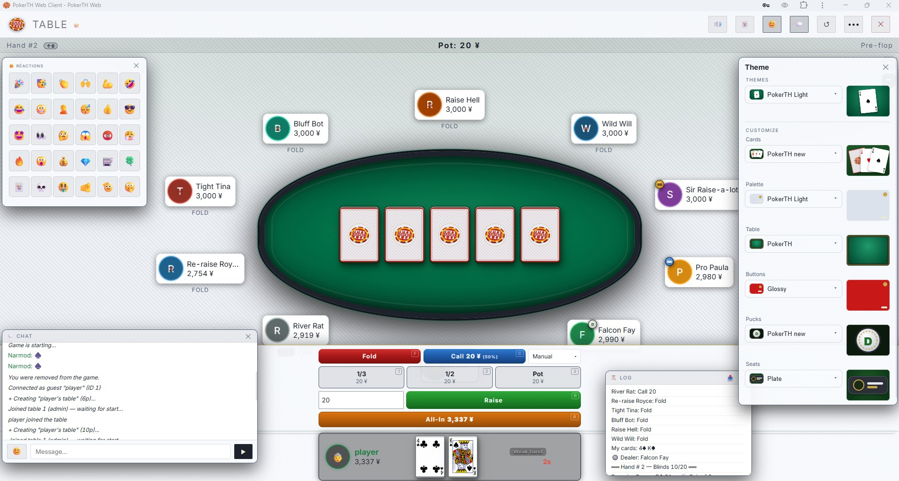
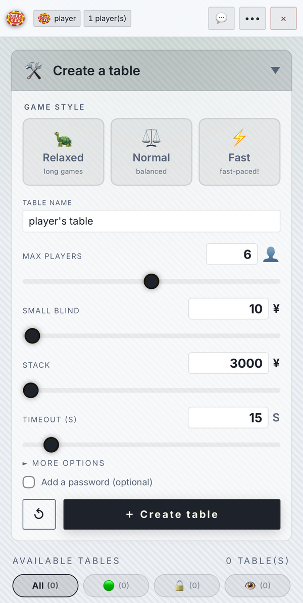
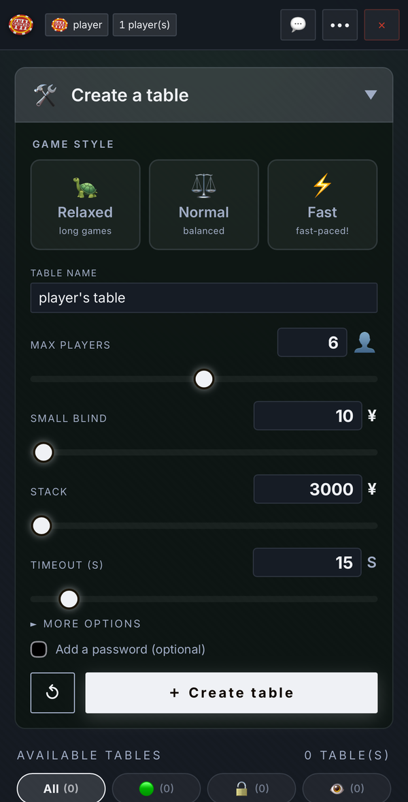
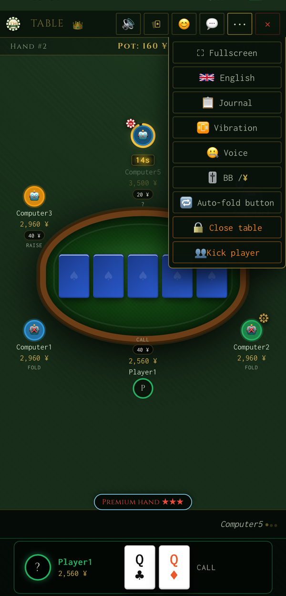

# PokerTH Web Client

> A modern, mobile-friendly browser client for [PokerTH](https://github.com/pokerth/pokerth) — the legendary open-source Texas Hold'em poker game.
>
> **Load once, play anywhere:** cached as a PWA for instant launches, fully offline against bots, and ready to connect to any PokerTH server when you are.

[](https://github.com/narmod/pokerth-web-client/actions/workflows/docker-publish.yml)
[](https://github.com/narmod/pokerth-web-client/pkgs/container/pokerth-web-client)
[](#raspberry-pi)
[](LICENSE)

---

## Contents

<sub>📂 = collapsible section — click the **“Show…”** line to expand it.</sub>

- [🎮 Live demo](#live-demo)
- [Why this project exists](#why-this-project-exists)
- [Screenshots](#screenshots)
- [Features](#features)
- [Login modes &amp; transport](#login-modes-transport)
- [Playing a game](#playing-a-game)
- [Architecture](#architecture)
- [Requirements](#requirements)
- [Self-hosting](#self-hosting)
  - [Quick install (one-liner)](#quick-install-one-liner) &nbsp;📂
  - [Docker](#docker) &nbsp;📂
  - [Manual installation (Ubuntu / Debian)](#manual-installation) &nbsp;📂
  - [Self-hosting on a Raspberry Pi](#raspberry-pi)
- [Install the app](#install-the-app)
- [Managing &amp; resetting](#managing-resetting)
  - [Managing the service](#managing-the-service)
  - [The admin panel](#admin-panel)
  - [Optional MySQL mirror](#mysql-mirror)
  - [Resetting the family leaderboard](#leaderboard-reset)
- [Development (running from source)](#development) &nbsp;📂
- [Protocol notes](#protocol-notes)
- [Known limitations](#known-limitations)
- [Roadmap / Suggested next steps](#roadmap)
- [License](#license)
- [Acknowledgements](#acknowledgements)

---

<a id="live-demo"></a>
## 🎮 Live demo

**Try it now: [https://pokerth.ddns.net/](https://pokerth.ddns.net/)**

Leave the server selector on **LAN / Dedicated server** (the default) with **Guest mode** unchecked, choose any nickname, and play right away — no account, no install. The demo is hosted on a small VPS connected to a private PokerTH server, so feel free to create a table and invite friends.

Want to try with **no server or connection at all**? Pick **🏋️ Training mode** and play instantly against bots — fully offline.

> Tip: it works just as well on mobile — add it to your home screen for a fullscreen app feel.

---

## Why this project exists

I have been playing PokerTH for years and have a deep appreciation for the incredible work the PokerTH team has put into this game over so many years. **Thank you** to every contributor who built and maintained it. ❤️

One day I wanted to play a family LAN game with my wife and teach poker to my kids — on tablets and phones, without installing anything. The problem: **there is no official web client for PokerTH**. You need the native desktop app, which does not run on iOS or Android.

So I sat down and built one.

It started as a very simple interface — just enough to deal a hand around the table. But every family game brought new feedback ("I can't tell the suits apart on my phone", "whose turn is it?", "can we have avatars?"), and little by little those suggestions grew the bare-bones prototype into the much more complete client it is today.

This project is a **web frontend** that connects to any PokerTH server directly from the browser, with no app installation needed. It is designed to work great on phones and tablets so that family poker nights are just a URL away.

---

## Screenshots

<p align="center">
  
  <br/>
  <em>Desktop view — full table with the live appearance panel (deck, palette, felt, buttons, pucks, seats), emoji reactions, in-game chat with its emoji picker, the action bar with keyboard hints, and the hand log</em>
</p>

<p align="center">
  
  <br/>
  <em>Connect screen — pick a login mode and join in seconds (light &amp; dark themes included)</em>
</p>

<div align="center">

<table>
  <tr>
    <td align="center"><strong>Create a table — light</strong></td>
    <td align="center"><strong>Create a table — dark</strong></td>
  </tr>
  <tr>
    <td align="center"></td>
    <td align="center"></td>
  </tr>
  <tr>
    <td align="center"><strong>Connect — light theme</strong></td>
    <td align="center"><strong>Table menu &amp; options</strong></td>
  </tr>
  <tr>
    <td align="center"></td>
    <td align="center"></td>
  </tr>
  <tr>
    <td align="center"><strong>Lobby &amp; chat</strong></td>
    <td align="center"><strong>Avatar picker</strong></td>
  </tr>
  <tr>
    <td align="center"></td>
    <td align="center"></td>
  </tr>
</table>

</div>

---

## Features

### Connection
- **3 server choices + a Guest-mode toggle**: pick **LAN / Dedicated server**, **pokerth.net**, or **🏋️ Training mode** (offline solo play against bots), then use the **Guest mode** checkbox (just above the Connect button, off by default) to switch the guest/registered variant of the two online choices. Internally the online choices still map to the four PokerTH login types; **Training mode runs entirely in the browser with no server, proxy, or connection**.
- Optional authenticated login over TLS
- TLS support (required for pokerth.net, optional for LAN). The TLS box auto-checks itself when you turn **Guest mode** off on pokerth.net (registered-account login).
- Auto-fill of `host = pokerth.net` and `port = 7234` when **pokerth.net** is selected — the dedicated-server choice keeps the auto-detected hostname
- Remember nickname / credentials via `localStorage`
- Refresh button and fullscreen toggle on every screen

### Lobby
- Real-time table list with player counts, status badges, and each table's blind level and raise schedule
- Table filters: **All / 🟢 Open / 🔓 No password / 👁 Watchable** (remembered across sessions)
- **⚡ Join or Create** — one-tap auto-join or table creation
- Advanced table creation: blinds, timeout (default 15 s), max players (default 5), **bot difficulty** (Easy / Mixed / Normal / Hard), **game-style presets** (🐢 Relaxed / ⚖️ Normal / ⚡ Fast), **blind-increase schedule** (every N hands or N minutes) with a raise mode (double / to a target / keep last), table speed (1–10), deal delay, **game type** (Normal / Registered-only / Invite-only), ranking on/off, spectators allowed/blocked, bots fill (with a min-humans-before-bots threshold), and an optional password
- Spectator mode (👁 Watch)
- Lobby chat

### Poker table
- Seats positioned according to server order, **locked after the first deal** (no mid-game layout jumps)
- **Responsive seat layout** — on phones and tablets the seats tighten around the felt so players stay close to the table; desktop keeps the wider layout
- **Table zoom** (desktop) — **+ / −** buttons by the table shrink the felt, community cards and opponents together (down to 60 %) or restore them up to the current size, while your own player bar and the action bar stay fixed; the level is remembered
- Casino-style chip tokens: SB 🔵, BB 🔴, Dealer ⚫ gold — with `chipPop` animation
- SVG arc timer around the active player's avatar + seconds badge below
- **Card deal animation**: cards fly from the centre to each seat at the start of every hand
- **Chip slide animation**: chips glide toward the pot on bet / call / raise
- **3D flip animation** for community cards (flop × 3, turn, river)
- Pre-flop hand-strength hint (Sklansky-Malmuth chart)
- **Post-flop win probability** — Monte Carlo simulation against random opponent ranges
- **Spades vs clubs visual distinction**: spades get a subtle blue tint so ♠ and ♣ never get confused on small screens
- Pot strip showing hand number, total pot, and current betting round

### In-game settings (⚙ menu)
Per-player toggles, remembered in `localStorage` and applied instantly:
- **BB / ¥ display** — show amounts as big blinds or as chips
- **Assistance** — show or hide the pre-flop hand-strength + post-flop win-probability help above the action bar
- **Quick-bet buttons** — 33 % / 50 % / 100 %-pot one-tap bets
- **Auto-action button** — pre-commit fold / check / call before it is your turn
- **Voice announcements** — spoken turn and action callouts (Web Speech API)
- **Vibration** — haptic feedback on your turn (where supported)
- **Sound on/off** (🔊) — mute or unmute all sound effects

### Themes & customization
A full appearance system, reached from the **Theme** button — pick a one-tap preset or fine-tune every axis yourself:
- **Presets** (one tap): **PokerTH Dark** (the default, reproducing the official client's look), **PokerTH Light**, and **Green Casino** — plus gallery themes (Midnight Blue, Graphite, Royal Purple, Sleek)
- **Customize** — six independent axes, each remembered in `localStorage`: UI **palette**, **table felt** (Green / Blue / Burgundy / Slate / PokerTH / Textured), **card deck** (PokerTH, PokerTH 1.0, PokerTH new, Green Casino), **action buttons** (Flat / Glossy), **chip pucks**, and **seat style**
- **Seat styles** — six theme-aware seat "packs", switchable like decks: **Classic** (the historical render), **Chip**, **Plate**, **Card**, **Compact**, and **Bar**. Pack names stay in English across all languages (like the poker terms). The default adapts to the device — **Compact on phones**, **Plate on tablet & desktop** — and any explicit choice is saved in `localStorage` and always wins
- **Light & dark aware**: every theme carries its own `color-scheme`, and the browser status-bar `theme-color` follows the active theme
- **Glossy coloured action buttons** (Fold red / Check-Call blue / Raise green / All-In orange) and a live preview of each card deck right in the panel
- Fully **localized in all 36 languages** and switchable instantly, with no reload
- Operators can set a **default theme** for first-time visitors (see [the admin panel](#admin-panel))

### Player experience
- **Emoji avatar** selector: 🎭 button → 500+ icons organised by category (animals, fantasy, fun characters…)
- Avatars visible by all players in real time (broadcast via proxy `AVATAR:pid:emoji`)
- **Custom image avatar** — use your own photo instead of an emoji, shared live with the table (broadcast via `AVATARIMG:pid:dataURL`)
- Anti-flicker cache so avatars survive seat re-renders
- Bots always show 🤖
- **Session statistics** panel (click your avatar): hands played, wins, win rate, net gain/loss, best/worst hand, last 5 hands with card history
- **Family leaderboard** (LAN / private server): a shared per-nickname ranking persisted on the server, **sortable** (net winnings, ¥ per 100 hands, hands played…), with a configurable automatic reset (off / daily / monthly / yearly) plus on-demand reset
- **Win streak badge** on seats for players on a hot run

### Chat & reactions
- In-lobby chat and in-game chat (dropdown panels)
- **Emoji picker in chat** (desktop) — a 😊 button in the chat input (both lobby and in-game) opens an emoji grid; click to insert it at the cursor, then send like any text. Hidden on mobile, where the native keyboard already provides emojis
- 30 emoji reactions with a 6-second counter, broadcast to all players
- **Cross-client reactions**: reactions also travel through a shared `/emoji` chat command (handled like `/me`), so they reach other clients and work on pokerth.net too — while a fast `REACT:` relay stays the web↔web path

### Comfort features
- Browser notifications when it is your turn (background tab)
- Tab title flashes: ⚡ YOUR TURN — PokerTH
- Keyboard shortcuts: **F** = Fold, **C** / Space = Call, **R** = Raise, **A** = All-in, plus **1 / 2 / 3** to arm a ⅓ / ½ / pot bet (then **R** to confirm) — the bet buttons show these keycaps on desktop
- Sound effects: distinct sounds for fold / check / call / raise / all-in / shuffle / drumroll / bad-beat / win fanfare, plus urgent-timer warning
- **Full i18n in 36 languages**, switchable on the fly and auto-detected from the browser locale — the complete official PokerTH language set plus community additions (Ukrainian, Romanian, Croatian, Serbian and more), with Brazilian and European Portuguese shipped as separate catalogues (pt-BR / pt-PT)
- Fullscreen mode on all screens
- Poker hand reference overlay (? button)
- Exponential-backoff auto-reconnect with live countdown

### PWA
- `manifest.json` + Service Worker (`sw.js`) with versioned **network-first** cache
- New-version notification: the page tells the user when an updated service worker is ready and applies the update on the next reload
- Installable on mobile and desktop ("Add to Home Screen")

---

<a id="login-modes-transport"></a>
## Login modes & transport

The client is designed first and foremost for **LAN and private self-hosted servers** — that is its intended use. The connect screen exposes **three server choices** plus a **Guest mode** checkbox (just above the Connect button, **off by default**). One choice — **🏋️ Training mode** — is fully offline (solo play against bots, no server at all); the two online choices, combined with the Guest-mode checkbox, map to the four underlying PokerTH login types, each with its own transport — handy to know when debugging a connection problem.

| Server choice | Guest mode | Login type | Transport | Notes |
|---|---|---|---|---|
| **🏋️ Training mode** | — | none — local engine | none — runs in the browser | **100% offline** solo play against bots; no server, proxy, or connection needed (works even as an installed PWA with no internet) |
| **LAN / Dedicated server** | off *(default)* | Internet guest (`unauth`, type 2) | proxy → TCP or TLS (your choice) | Default for self-hosted setups; in-game chat & reactions **enabled** |
| **LAN / Dedicated server** | on | Pure LAN (`lan`, type 0) | proxy → TCP raw | The server **refuses** in-game chat/reactions (reactions stay LAN-local) |
| **pokerth.net** | on | Guest (`guest`, type 2) | direct TLS WebSocket | Throwaway guest on the public server |
| **pokerth.net** | off | Registered account (`auth`, type 1) | direct TLS WebSocket | Login + password; TLS auto-enabled |

The pokerth.net rows connect **directly over a TLS WebSocket, bypassing the proxy**. Please use the public server responsibly and prefer your own LAN or private server for regular play, out of respect for the official PokerTH infrastructure.

---

<a id="playing-a-game"></a>
## Playing a game

Just want to deal a hand with the family? Start a private table in seconds:

<a id="quick-start-lan"></a>
### Quick start — LAN family game

1. Run the proxy on any computer on your local network.
2. Find that computer's local IP (e.g. `192.168.1.10`).
3. Open `http://192.168.1.10:8080` on any phone or tablet on the same Wi-Fi.
4. Leave the server selector on **LAN / Dedicated server** (the default), pick a nickname, and join or create a table.
5. Deal cards and enjoy!

---

## Architecture

Browsers cannot open raw TCP/TLS connections to classic PokerTH servers. This project bridges the gap with a tiny Node.js proxy:

```text
Browser WebSocket  ⇄  proxy.js (Node.js)  ⇄  PokerTH TCP/TLS server
```

When connecting to the public pokerth.net server, the browser connects directly over a TLS WebSocket and the proxy is bypassed.

Beyond bridging WebSocket frames to the server's raw TCP/TLS stream, `proxy.js` is a small application server. Its functions:

- **Static file server** — serves the client (HTML/JS/CSS and PWA assets) over HTTP, with on-the-fly **brotli/gzip compression** cached by file mtime.
- **Session persistence & seamless reconnect** — each browser session is keyed by a `sid`. If the WebSocket drops (e.g. a phone switching Wi-Fi ↔ cellular), the upstream PokerTH connection is **kept alive for a 2-minute grace period**, and the next connection presenting the same `sid` is rebound to it — no re-login, no lost seat. A **heartbeat (ping/pong) plus an RX watchdog** detect genuinely dead sockets.
- **Clean intentional disconnect** — when the user actively leaves (the ✕ button), the client closes the WebSocket with code **4001**. The proxy treats this as a deliberate quit and tears down the upstream **immediately**, skipping the grace period, so the player/nick is freed on the server right away instead of lingering as a "ghost" for ~2 minutes.
- **Custom broadcast relays** — three application messages are fanned out to the other connected clients. Relays are **scoped per upstream** (`host:port`) so they only reach players on the same server, and oversized frames are dropped:

| Message | Purpose |
|---|---|
| `REACT:pid:emoji` | Emoji reaction from a player |
| `AVATAR:pid:emoji` | Avatar emoji update |
| `AVATARIMG:pid:dataURL` | Custom image-avatar update |

- **Connection allowlist** — for anti-open-relay safety the proxy only dials servers on a configured allowlist (see the deployment section below).
- **Helper endpoints** — `GET /__ver` reports the newest mtime of the static assets (this drives the client's "new version" banner), `GET /app-config` exposes the operator's client settings (enabled login modes, default theme & in-game settings, server identity, welcome message), and `GET /stats` serves the shared lifetime leaderboard.

### Repository layout

```text
pokerth-web-client/
├── proxy.js                 # WS→TCP/TLS proxy + static HTTP server
├── public/
│   ├── pokerth-client.html  # HTML shell + inline head scripts
│   ├── admin.html           # Maintainer console (served at /admin)
│   ├── pokerth.js           # Full application logic
│   ├── pokerth.css          # Styles
│   ├── manifest.json        # PWA manifest
│   ├── sw.js                # Service Worker (versioned cache)
│   ├── modules/             # ES modules
│   │   ├── i18n.mjs         #   internationalisation (36 languages)
│   │   ├── sounds.mjs       #   sound effects
│   │   ├── theme.mjs        #   theming engine (palettes, decks, seats, presets)
│   │   ├── lang/            #   36 language catalogues
│   │   └── offline/         #   local game engine + bots (Training mode)
│   ├── proto/               # Protobuf bundle & helpers
│   └── favicon-*.png        # PWA icons
├── docs/
│   ├── PROJECT.md
│   ├── ROADMAP.md
│   ├── SECURITY.md
│   └── screenshots/         # Screenshots used in this README
├── scripts/
│   ├── build-proto.mjs      # Regenerates the protobuf bundle from .proto
│   └── reset-stats.mjs      # Clears the family leaderboard (npm run stats:reset)
├── install.sh               # Installer / updater / uninstaller (one-liner)
├── Dockerfile               # Multi-arch image (node:20-alpine base)
├── docker-compose.yml       # One-shot self-host config
├── package.json
├── LICENSE                  # AGPL-3.0-or-later
└── README.md
```

---

## Requirements

- **Node.js 18** or newer (Node 20 LTS recommended)
- **npm** (shipped with Node.js)
- **git**
- A modern browser (Chrome, Firefox, Safari, Edge)
- A running PokerTH server (local LAN, your own remote server, or pokerth.net)

---

<a id="self-hosting"></a>
## Self-hosting

Run your own PokerTH proxy with whichever method suits you:

- [Quick install (one-liner)](#quick-install-one-liner) — fastest, on Debian/Ubuntu
- [Docker](#docker) — containerised, multi-arch
- [Manual installation](#manual-installation) — step by step, full control
- [Self-hosting on a Raspberry Pi](#raspberry-pi) — host it at home

Once running, manage it from one place — see [Managing & resetting](#managing-resetting).

---

## Quick install (one-liner)

<details>
<summary><b>📂 Show the one-liner install guide</b></summary>

On a fresh **Debian/Ubuntu** machine you can install everything — Node.js, PM2, the project, and a boot-persistent service — with a single command:

```bash
curl -sSL https://raw.githubusercontent.com/narmod/pokerth-web-client/HEAD/install.sh | bash
```

The installer asks a couple of questions (port, LAN/TLS mode, install directory), then runs the proxy under PM2 as a **non-root** user with start-on-boot. It is safe to re-run: an existing install is updated rather than duplicated.

> **Prefer to read before you run?** A healthy instinct for any `curl | bash` installer. Download and inspect it first:
>
> ```bash
> curl -sSL https://raw.githubusercontent.com/narmod/pokerth-web-client/HEAD/install.sh -o install.sh
> less install.sh        # review what it does
> bash install.sh        # then run it
> ```

When run without a terminal (CI / automation) the installer is fully non-interactive and takes its settings from environment variables:

| Variable | Default | Purpose |
|---|---|---|
| `PORT` | `8080` | HTTP / WebSocket port |
| `NO_TLS` | _(unset)_ | set to `1` for LAN mode (`--notls`) |
| `INSTALL_DIR` | `<run-user home>/pokerth-web-client` | install location |
| `RUN_USER` | invoking user, or `pokerth` when run as root | non-root user that runs PM2 |
| `APP_NAME` | `pokerth-web` | PM2 process name |
| `SETUP_FIREWALL` | _(unset)_ | set to `1` to open the port in `ufw` |
| `ASSUME_YES` | _(unset)_ | set to `1` to skip the confirmation prompt |
| `STATS_RESET_PERIOD` | `monthly` | leaderboard auto-reset: `off` / `daily` / `monthly` / `yearly` |
| `STATS_ADMIN_TOKEN` | _(unset)_ | token enabling the remote leaderboard-reset endpoint |

Example:

```bash
PORT=8090 NO_TLS=1 ASSUME_YES=1 \
  bash -c "$(curl -sSL https://raw.githubusercontent.com/narmod/pokerth-web-client/HEAD/install.sh)"
```

For HTTPS (recommended — many mobile browsers block plain `ws://`), follow the Nginx + Let's Encrypt steps in the manual installation below.

</details>

---

<a id="docker"></a>
## Docker

<details>
<summary><b>📂 Show the Docker guide</b></summary>

The repository ships with a `Dockerfile` and a `docker-compose.yml`. By default Compose **pulls a prebuilt multi-architecture image** from GHCR (`amd64` / `arm64` / `armv7`), so there is **nothing to compile** — ideal on a Raspberry Pi.

**1. Configure the allowlist.** For anti-open-relay reasons the proxy only dials servers on an allowlist. `pokerth.net` works out of the box, but to reach **your own** LAN / private server you must add it. Copy the example env file and edit it:

```bash
cp .env.example .env
# then edit .env and add your server to ALLOWED_HOSTS
```

```dotenv
# .env
PORT=8080
ALLOWED_HOSTS=pokerth.net,www.pokerth.net,mybox.ddns.net,192.168.1.10
```

> If your PokerTH server runs on the **same machine** as Docker, use `host.docker.internal` (Docker Desktop) or the host's LAN IP in both `ALLOWED_HOSTS` and the connect form — **not** `localhost`, which from inside the container points to the container itself.

**2. Start it:**

```bash
docker compose up -d      # pulls the prebuilt image and starts the proxy
docker compose pull       # later: fetch the newest image, then `up -d` again
```

The proxy will be available on `http://<host>:8080/` (or whatever `PORT` you set).

**Without Compose** (e.g. a quick run on a Pi):

```bash
docker run -d --name pokerth-web -p 8080:8080 \
  -e ALLOWED_HOSTS=pokerth.net,www.pokerth.net,mybox.ddns.net \
  -v pokerth-stats:/data \
  ghcr.io/narmod/pokerth-web-client:latest
```

Notes:
- The container runs as the non-root `node` user.
- The shared **family leaderboard** (`stats.json`) is persisted in a named volume (`pokerth-stats`), so it survives `docker compose down && up`. (Per-device session stats live in each browser, not on the server.)
- Set `STATS_RESET_PERIOD` (and optionally `STATS_ADMIN_TOKEN`) in `.env` to control the leaderboard auto-reset — see [Resetting the family leaderboard](#leaderboard-reset).
- A healthcheck pings the HTTP server every 30 s; `docker ps` shows the container as `healthy` once it is up.
- `PORT` only changes the **published host port** — the container always listens on `8080` internally.
- Prefer to build the image yourself? Comment out `image:` in `docker-compose.yml` and uncomment `build: .`.

</details>

---

<a id="manual-installation"></a>
## Manual installation (Ubuntu / Debian)

<details>
<summary><b>📂 Show the full step-by-step guide</b></summary>

Prefer to do it by hand, or need a custom setup? These are the full steps the one-liner automates. This walkthrough assumes a clean Ubuntu 22.04 / 24.04 or Debian 12 VPS. Adapt commands for other distributions.

### 1. Update the system

```bash
sudo apt update && sudo apt upgrade -y
```

### 2. Install build tools, git and curl

```bash
sudo apt install -y curl git build-essential
```

### 3. Install Node.js 20 LTS (via NodeSource)

The Node.js shipped in Ubuntu's default repos is often too old. Use the official NodeSource repo to get a recent LTS:

```bash
curl -fsSL https://deb.nodesource.com/setup_20.x | sudo -E bash -
sudo apt install -y nodejs
```

Verify:

```bash
node -v   # should print v20.x.x or newer
npm -v    # should print 10.x or newer
```

### 4. Install PM2 globally (process manager)

PM2 keeps the proxy alive in the background and restarts it automatically at boot or after a crash.

```bash
sudo npm install -g pm2
```

### 5. Clone the project and install dependencies

```bash
git clone https://github.com/narmod/pokerth-web-client.git
cd pokerth-web-client
npm install
```

You may see two `npm WARN deprecated` lines about `inflight` and `glob` — these are pulled in by `protobufjs-cli` (a dev-only dependency used to rebuild the protobuf bundle). They are harmless at runtime. `npm audit` should report **0 vulnerabilities**.

### 6. Open the firewall

If `ufw` is active on the server:

```bash
sudo ufw allow 8080/tcp     # if you serve directly on 8080
# OR (recommended) 80/443 if you put Nginx in front
sudo ufw allow 80/tcp
sudo ufw allow 443/tcp
```

Cloud providers (IONOS, OVH, Hetzner, etc.) often have their **own firewall in front of the VPS** that is independent of `ufw`. Make sure to open the same ports in their control panel too, otherwise the port stays unreachable from outside.

### 7. Start the proxy with PM2

```bash
pm2 start proxy.js --name pokerth-web
pm2 save
pm2 startup       # then run the command it prints, to enable boot-time start
```

Verify:

```bash
pm2 status
pm2 logs pokerth-web --lines 30
```

The client is now live at `http://<your-server-ip>:8080`.

### 8. (Recommended) Add HTTPS with Nginx + Let's Encrypt

A direct WebSocket on port 8080 works, but many mobile browsers and corporate networks **block plain `ws://` connections**. Adding HTTPS via Nginx solves this for free and gives you a clean URL.

You need a domain name pointing to the server's IP. Free options include [No-IP](https://www.noip.com/) (`yourname.ddns.net`) or [DuckDNS](https://www.duckdns.org/) (`yourname.duckdns.org`).

Install Nginx and Certbot:

```bash
sudo apt install -y nginx certbot python3-certbot-nginx
```

Create `/etc/nginx/sites-available/pokerth` (replace `your-domain.example` with your real hostname):

```nginx
server {
    listen 80;
    server_name your-domain.example;

    location / {
        proxy_pass http://localhost:8080;
        proxy_http_version 1.1;
        proxy_set_header Upgrade $http_upgrade;
        proxy_set_header Connection "upgrade";
        proxy_set_header Host $host;
        proxy_set_header X-Real-IP $remote_addr;
        proxy_set_header X-Forwarded-For $proxy_add_x_forwarded_for;
        proxy_set_header X-Forwarded-Proto $scheme;
        proxy_read_timeout 86400;
        proxy_send_timeout 86400;
    }
}
```

Enable and reload:

```bash
sudo ln -s /etc/nginx/sites-available/pokerth /etc/nginx/sites-enabled/
sudo rm -f /etc/nginx/sites-enabled/default
sudo nginx -t
sudo systemctl reload nginx
```

Obtain the certificate (Certbot will edit the config to add HTTPS automatically):

```bash
sudo certbot --nginx -d your-domain.example
```

Pick option `2 — Redirect HTTP to HTTPS` when asked. Renewal is automatic via a systemd timer.

The client is now live at `https://your-domain.example`. In the connect form, the WebSocket Proxy URL field will auto-fill with `wss://your-domain.example` (the JS detects the protocol).

### 9. Updating later

Update in one command — see [Managing & resetting](#managing-resetting):

```bash
sudo pokerth-web update
```

If you set things up manually (no `pokerth-web` command), update from your checkout: `git pull --ff-only`, then `npm install --omit=dev` and `pm2 restart pokerth-web --update-env && pm2 save`.

</details>

---

<a id="raspberry-pi"></a>
## Self-hosting on a Raspberry Pi 🥧

Both the PokerTH server **and** this web proxy are extremely light: PokerTH is a turn-based card game exchanging small Protobuf messages, so a 10-player table is a trivial load. The players' phones do all the rendering — the Pi just relays messages and serves static files. That makes a Pi a perfect always-on box for family / LAN games.

**Which model?**

| Model | Verdict |
|---|---|
| **Pi 4 (2 GB)** | ✅ Recommended sweet spot — Gigabit Ethernet, comfortable headroom, smooth `npm install` / `git`. |
| **Pi 5** | Overkill but fastest; great if you want room for other services. |
| **Pi 3B+ (1 GB)** | Works fine for runtime. |
| **Pi Zero 2 W (512 MB, Wi-Fi only)** | Not recommended — tight RAM for `npm install`, no wired Ethernet. |

**For a smooth game, the network matters more than the Pi:**

- Connect the Pi to your router by **wired Ethernet** — the server stays rock-solid.
- The quality of your **Wi-Fi / access point** affects the 10 players more than the Pi's CPU.
- Prefer booting from a **USB SSD** (Pi 4/5) over a microSD for reliability with PM2 logs; otherwise use a good A1/A2 card.

**Install:**

1. Flash a **64-bit, Debian-based OS** — **Raspberry Pi OS (64-bit) is recommended** (Debian arm64 works too). An `apt`-based system is required: the one-liner installer needs `apt` and stops cleanly on non-apt distros (Alpine, Fedora…).
2. Install the PokerTH server — it is packaged for Debian / Ubuntu including ARM:
   ```bash
   sudo apt update && sudo apt install pokerth-server
   ```
   (If your distro doesn't ship it, build it from the [upstream sources](https://github.com/pokerth/pokerth).) Run `pokerth_server`; it listens on TCP **7234** by default.
3. Install the web proxy with the one-liner — it sets up Node.js 20, PM2, the project and a boot service, and works on ARM:
   ```bash
   curl -sSL https://raw.githubusercontent.com/narmod/pokerth-web-client/HEAD/install.sh | bash
   ```
   Prefer to do it by hand, or inspect the script first? See [Manual installation](#manual-installation).
4. From any phone on the same Wi-Fi, open `http://<pi-ip>:8080`, leave the server on **LAN / Dedicated server**, and deal.

> **PWA extras (install to home screen, offline, notifications) need HTTPS** — see [Known limitations](#known-limitations). The game itself works perfectly over plain `http://` / `ws://` on the LAN.

---

<a id="install-the-app"></a>
## Install the app (as a PWA)

Once your proxy is running, open the client and install it **from your own server's address** (the URL the proxy serves — e.g. `https://your-domain` or `http://192.168.x.x:8080`). The connect form auto-fills the WebSocket Proxy URL and the PokerTH host from the page it is served on, and a PWA is cached under that origin — so the installed app keeps **your** server pre-loaded and you never retype it. Installing from any other address would point it elsewhere and force you to re-enter the server every time.

> A fully installable PWA (standalone window, offline cache, notifications) needs a **secure context** — HTTPS, or `localhost`. Set up [Nginx + HTTPS](#manual-installation) for the install option to appear; over plain LAN `http://` the game still works in the browser, but the install prompt won't show.

Then pin it like a native app:

- **Desktop — Chrome / Edge / Brave (Windows, macOS, Linux, ChromeOS):** click the **install icon** in the address bar (or the ⋮ menu → **Save and share → Install page as app**) → **Install**. It opens in its own window, without tabs or toolbar. ⚠️ If you use **Create shortcut** instead, tick **"Open as window"** — otherwise it just opens as an ordinary browser tab, not a standalone full-window app.
- **Android (Chrome / Edge / Brave):** browser menu → **Install app** / **Add to Home screen**.
- **iPhone / iPad:** in **Safari**, tap **Share → Add to Home Screen → Add**. (iOS installs PWAs from Safari only; since iOS 17, Chrome and Edge also offer it via their Share button.)

The in-app **📲 Install** hint appears automatically when your browser supports installation. Once installed, **Training mode** runs with no internet at all; online play (LAN, your dedicated server, or pokerth.net) just needs to reach the chosen server.

---

<a id="managing-resetting"></a>
## Managing & resetting

<a id="managing-the-service"></a>
### Managing the service

After a first install, a `pokerth-web` command is available to manage everything — no need to touch PM2 by hand:

```bash
sudo pokerth-web update              # pull the latest version, reinstall deps, restart
pokerth-web status                   # show the PM2 status
sudo pokerth-web set-period yearly   # leaderboard auto-reset: off | daily | monthly | yearly
sudo pokerth-web reset-stats         # wipe the family leaderboard now
sudo pokerth-web set-token SECRET    # admin token: unlocks the admin panel + remote reset (no token = both off)
sudo pokerth-web admin off           # hide the admin panel (/admin returns 404); 'on' to show it again
sudo pokerth-web db-config           # configure the optional MySQL mirror (interactive)
sudo pokerth-web db-on               # enable the MySQL mirror (db-off to disable)
sudo pokerth-web db-show             # show the mirror config, password masked
sudo pokerth-web uninstall           # stop and remove the service
pokerth-web help                     # list every command
```

`set-period`, `set-token` and `admin on|off` are saved to `/etc/pokerth-web.conf` and **re-applied automatically on every update and reboot**, so you set them once.

The same actions work through the one-liner if you prefer not to use the command:

```bash
curl -sSL https://raw.githubusercontent.com/narmod/pokerth-web-client/HEAD/install.sh | bash -s -- update
```

`uninstall` removes the PM2 service, its boot entry, the state file and the `pokerth-web` command, then asks separately before deleting the install directory or the dedicated service user. It never touches Node.js, PM2 or apt packages.

<a id="admin-panel"></a>
### The admin panel

A self-hosted maintainer console lives at **`/admin`** (e.g. `https://your-host/admin`). It is governed by two independent switches:

- **Visibility — `pokerth-web admin on|off`.** When **off**, `/admin` and every `/admin/*` route return a plain `404`, so the panel is fully hidden — not merely inert. **On** is the default and serves the panel. The setting is saved to `/etc/pokerth-web.conf` and re-applied on every update and reboot.
- **Authentication — `pokerth-web set-token <token>`.** Every action in the panel requires this token; with no token set, the page still loads but all actions are refused. The same token also guards the remote `/stats` reset endpoint.

A good rule of thumb: set a token before relying on the panel, and run `pokerth-web admin off` whenever you don't need it exposed. Always serve it over **HTTPS** — the panel sends the token in an `Authorization: Bearer` header, so it never lands in URLs, logs or browser history.

To use it, open `/admin`, paste your token and **Log in**. The console is organised into seven tabs:

- **Server** — live status (version, uptime, connected players, open sockets); one-click self-update **with or without a restart**; schedule a restart or update with a countdown banner shown to players; tune **proxy settings** (extra allowed hosts, session-grace window, connection gap); and view, clear or act on the logs.
- **Traffic** — privacy-friendly visit analytics: visits and unique visitors across rolling windows (today → 365 days), a daily trend chart, a **new-vs-returning** split, and a **per-server breakdown** (pokerth.net / LAN / Offline); export it all as CSV or JSON, or reset it. This tab also configures the **optional MySQL mirror** (see [Optional MySQL mirror](#mysql-mirror) below): host, user, password and database, an enable switch, plus **Test connection** and **Save & connect** (applied live, no restart).
- **Clients** — what new visitors get by default: which **login modes** (Offline / LAN / pokerth.net) appear on the connect screen, the **default login form** (mode + host), a **default theme**, **default in-game settings** (BB display, assistance, quick-bet, auto-action, voice, vibration), **default table-creation settings** (max players, small blind, starting stack, action timer), and a **server identity** (name + tagline) that replaces "PokerTH" / "Web Client" on the login screen.
- **Broadcasts** — send a message to all connected players right now, or on a **recurring schedule** (interval / daily / every-N-days / weekly / monthly / once, with an icon, end date and max sends); plus an editor for the multilingual **welcome / rules message** shown on a player's first visit — with **on-device auto-translation** (where the browser supports it) to fill languages you haven't written yourself.
- **Leaderboard** — reset the shared leaderboard immediately and set its auto-reset period.
- **Packages** — install or remove gallery **card decks** and **table styles** from a `.zip` file or URL, and **enable/disable** each one without deleting its files.
- **Music** — manage the in-app background-music playlist: upload tracks, edit their titles, credits and licence links, reorder them, and enable or disable each one.

<a id="mysql-mirror"></a>
### Optional MySQL mirror

By default the server keeps everything it needs in small JSON files (`stats.json`, `visits.json`, `broadcasts.json`) — no database required. If you'd like to also stream that data into **MySQL / MariaDB** — for dashboards, backups or external reporting — you can switch on an optional mirror. The JSON files always remain the live source of truth; MySQL is written **in addition**, never instead.

When enabled, three tables are kept in sync and created automatically on first connect: **`traffic_daily`** (daily visits, unique / new / returning, per-server counts), **`leaderboard`** (per-nickname lifetime stats) and **`broadcasts`** (your scheduled messages).

You can configure it three ways — whichever suits you:

- **Admin panel** — the *Traffic* tab has a form (host, port, user, password, database) with an **Enabled** switch, a **Test connection** button, and **Save & connect**, which reconnects live with no restart.
- **Command line** — `sudo pokerth-web db-config` walks through the same settings (the password prompt is hidden; leave it blank to keep the current one), then restarts. `pokerth-web db-on` / `db-off` toggle the mirror, and `pokerth-web db-show` prints the config with the password masked.
- **Environment variables** — set `MYSQL_HOST` and `MYSQL_DATABASE` (and optionally `MYSQL_PORT`, `MYSQL_USER`, `MYSQL_PASSWORD`). Convenient for Docker or an existing ops setup.

Both the admin form and the CLI write to **`db-config.json`** in the install directory (created with `600` permissions; the password is stored there and is **never returned** by the admin API). **Environment variables take precedence** when set — useful as an ops override — and in that case the admin form shows the active source and locks itself. The `mysql2` driver ships with the project, so there's nothing else to install.

<a id="leaderboard-reset"></a>
### Resetting the family leaderboard

The shared leaderboard (per-nickname **lifetime** stats) lives in `stats.json` on the server. Per-device **session** stats stay in each browser and are never touched by any of this.

**Automatic reset.** The `STATS_RESET_PERIOD` environment variable controls how often the leaderboard wipes itself — `off`, `daily`, `monthly` (**default**) or `yearly`. The boundary is the server's local time, and the current period is remembered, so a restart never triggers a false reset.

With the one-liner installer, set it with a single command — it's saved and re-applied automatically on every update and reboot:

```bash
sudo pokerth-web set-period yearly     # off | daily | monthly | yearly
```

You can also choose it at install time: `curl -sSL .../install.sh | STATS_RESET_PERIOD=yearly bash`.

**On-demand reset — command line.** If you used the one-liner installer, a single command wipes the leaderboard and restarts the service:

```bash
sudo pokerth-web reset-stats
```

From a manual checkout, do it by hand:

```bash
npm run stats:reset          # empties stats.json
pm2 restart pokerth-web      # restart so a running proxy drops its in-memory copy
```

**On-demand reset — remote.** Set an `STATS_ADMIN_TOKEN`, then POST to `/stats` (the endpoint stays disabled until a token is set):

```bash
curl -X POST http://your-host:8080/stats \
     -H 'Content-Type: application/json' \
     -d '{"_resetAll":true,"token":"YOUR_TOKEN"}'
```

With the one-liner installer, set or clear that token in one command (saved and re-applied like the period): `sudo pokerth-web set-token YOUR_TOKEN` (run it with no token to disable the endpoint).

Set these via `.env` under Docker, or pass them when (re)starting PM2, e.g. `STATS_RESET_PERIOD=yearly pm2 restart pokerth-web --update-env`.

---

<a id="development"></a>
## Development (running from source)

<details>
<summary><b>📂 Show the local-development guide</b></summary>

If you only want to play around on your own machine:

```bash
git clone https://github.com/narmod/pokerth-web-client.git
cd pokerth-web-client
npm install
```

### Standard (TLS enabled, recommended)

```bash
npm start
```

Then open **http://localhost:8080** in your browser.

### LAN (no TLS)

```bash
npm run start:lan
```

### Custom port

```bash
node proxy.js 8090
```

### Development (ignore untrusted TLS certificate)

```bash
npm run start:insecure
```

> ⚠️ `--insecure` disables TLS certificate verification. Use only for local development.

</details>

---

## Protocol notes

PokerTH speaks a length-prefixed Protobuf-based protocol over TCP. This client parses and emits a hand-written subset of those messages — there is no full Protobuf runtime in the browser, which keeps the bundle small.

A few things worth knowing if you plan to hack on this:

- The proxy logs every parsed message in hex with a short description, which makes protocol debugging straightforward (`pm2 logs pokerth-web` if you run under PM2).
- Wire-type field numbers used by this client are documented inline in `public/pokerth.js` next to each `Proto.encode([...])` call, with references to `pokerth.proto` in the upstream repository.

---

## Known limitations

- The Protobuf protocol is still handled by a small hand-written encoder/decoder rather than generated classes.
- The bulk of the logic still lives in a single `pokerth.js` file, though i18n, sounds and the protocol layer have already been extracted into ES modules. Further splitting would help.
- More automated protocol tests are needed before calling the client production-ready.
- Spectator mode works but lacks a few quality-of-life touches (e.g. you cannot see other players' cards at showdown the same way the native client does).
- **Training-mode bots use a simple heuristic AI.** They're perfect for learning the flow, practising the interface, or playing offline with no server — but they won't bluff or adapt like a strong human opponent.
- **PWA features (install to home screen, offline Service Worker, background notifications) require a *secure context*** — i.e. HTTPS, or `localhost`. Over plain `http://` on a LAN IP (e.g. `192.168.1.10:8080`) the game plays perfectly, but the browser disables those three features by design. To get them on a LAN, serve the client over HTTPS — e.g. [`mkcert`](https://github.com/FiloSottile/mkcert) for a locally-trusted certificate, a self-signed cert, a real domain with Let's Encrypt, or a tunnel such as Cloudflare Tunnel / Tailscale.
- **Translations are not yet natively reviewed.** The 36 language catalogues were produced with care but are largely machine-assisted, so some wordings — especially poker-specific terms — may be imperfect, the less common languages (e.g. Scottish Gaelic, Tamil) most of all. Corrections via issue or pull request are very welcome.

---

<a id="roadmap"></a>
## Roadmap / Suggested next steps

1. **Adopt the generated Protobuf bindings.** A protobuf.js runtime and classes generated from `pokerth.proto` now live in `public/proto/`; what remains is switching `pokerth.js` over from its inline hand-written codec to that bundle.
2. Split the client into maintainable ES modules *(in progress — i18n, sounds and the Protobuf bindings are already extracted; the bulk still lives in `pokerth.js`)*.
3. Add automated protocol tests with a mock PokerTH server.
4. Polish reconnection edge cases *(currently exponential backoff, capped at 3–6 attempts depending on the transport)*.
5. Custom-emoji / image avatar import *(the built-in picker already ships 500+ emojis)*.
6. A read-only embed for streamers *(spectating a table already works; this would add a dedicated streamer-friendly view)*.
7. Native review of the machine-assisted translations *(36 languages ship today; some wordings — poker terms especially — would benefit from a native pass)*.

---

## License

This project is licensed under the **GNU Affero General Public License v3.0 or later** — the same license as PokerTH itself.

---

## Acknowledgements

A huge thank you to the entire **PokerTH team** for creating and maintaining such a wonderful open-source poker game over all these years. This project would not exist without your work. 🙏
